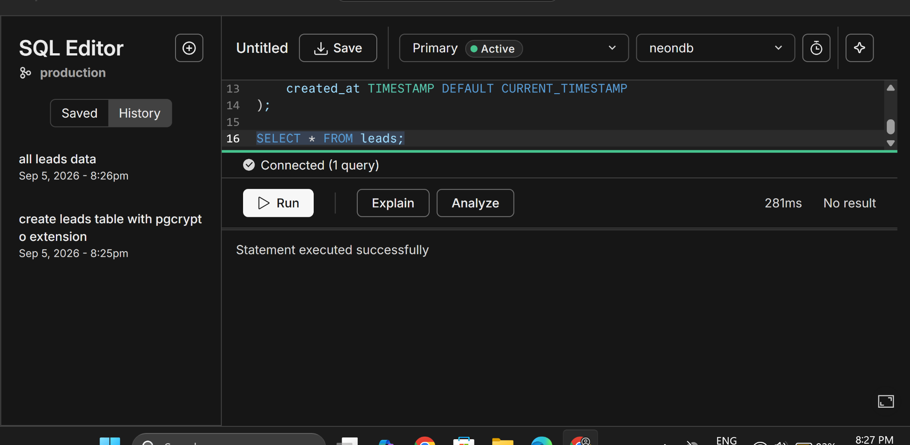
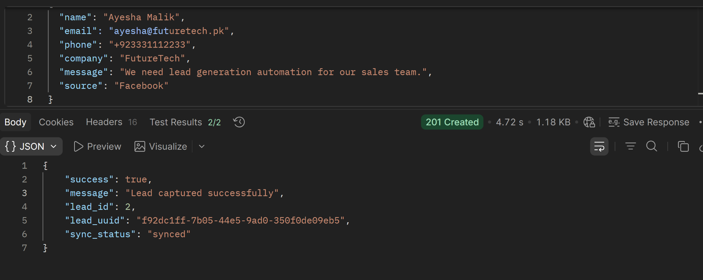
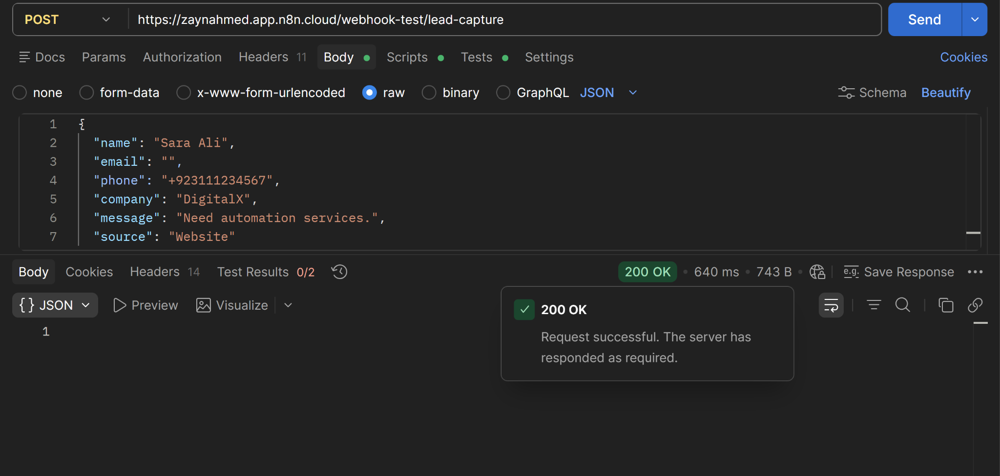
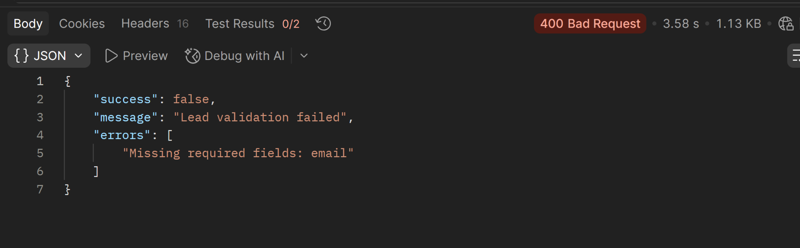
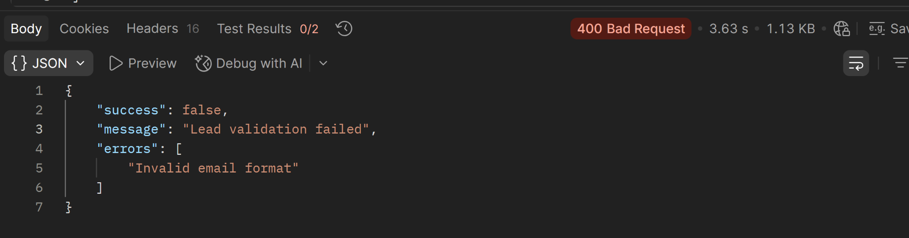
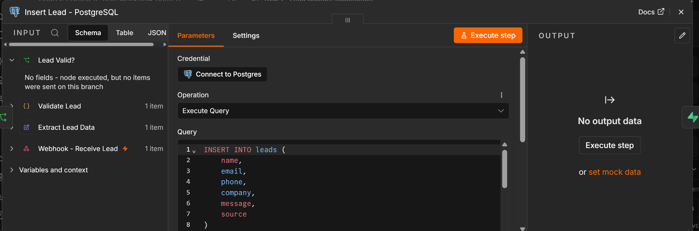
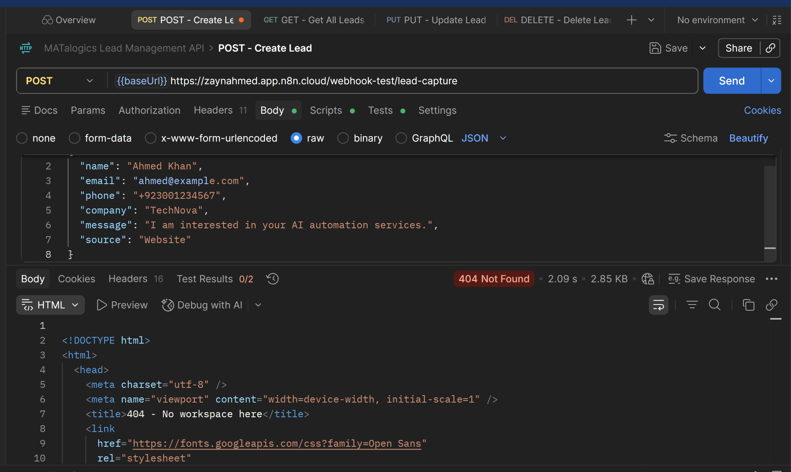
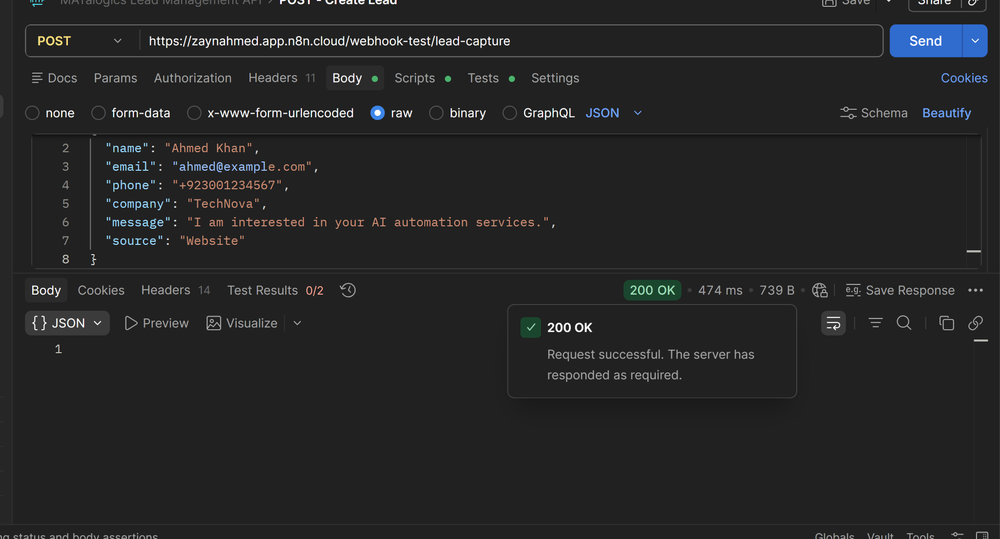
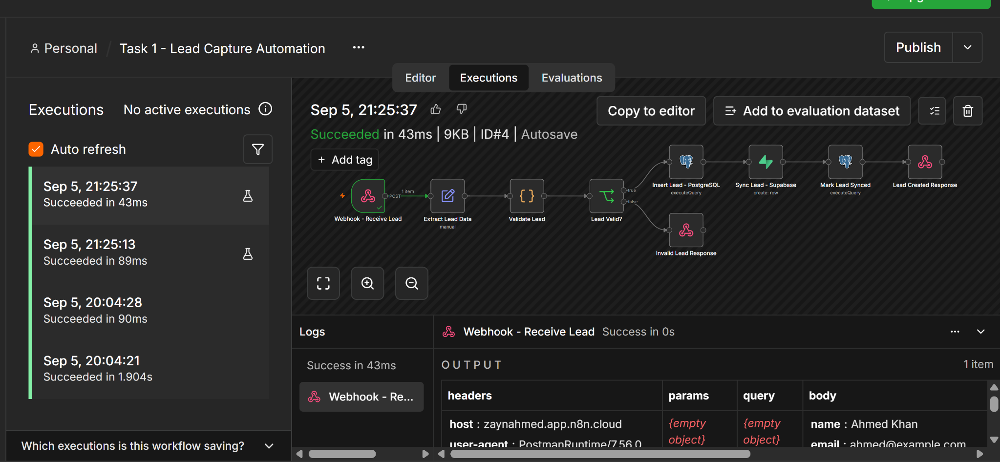
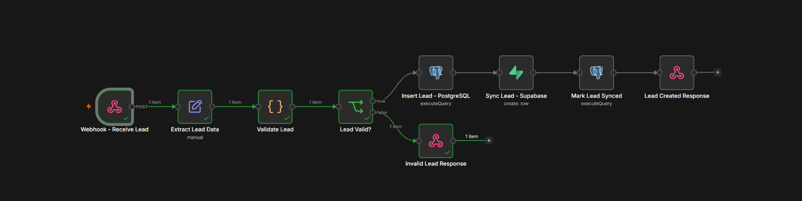

# Task 5 — Lead Capture Automation

## Project Overview

This project implements a complete **Lead Capture Automation** using **n8n Cloud**, **PostgreSQL**, and **Supabase**.

The automation receives lead data from a website or API through an n8n webhook, validates the submitted information, stores valid leads in a PostgreSQL database hosted on **Neon**, synchronizes the same records into **Supabase**, updates the PostgreSQL synchronization status, and returns an appropriate HTTP response.

This task demonstrates the required data movement:

```text
Website / API / Postman
        ↓
      n8n
        ↓
   PostgreSQL
      (Neon)
        ↓
    Supabase
        ↓
PostgreSQL Sync Update
        ↓
   n8n Response
```

For invalid input, the workflow stops before any database write and returns an HTTP `400 Bad Request`.

## Project Screenshots

The screenshots below were captured while configuring and testing the working automation. They are placed again in the relevant technical sections of this README for easier verification.

> **Security note:** screenshots are included only as implementation evidence. Database passwords and secret keys should remain hidden and must never be committed to a public repository.

---

# Assignment Scenario

A website sends a new lead to n8n through a webhook.

The incoming lead contains:

- `name`
- `email`
- `phone`
- `company`
- `message`
- `source`

The automation must:

1. Receive the lead through a webhook.
2. Validate all required fields.
3. Validate the email format.
4. Insert valid lead data into PostgreSQL.
5. Synchronize the same lead into Supabase.
6. Update the PostgreSQL record after successful synchronization.
7. Return a successful response for valid data.
8. Return an error response for missing or invalid data.

---

# Technologies Used

| Technology | Purpose |
|---|---|
| n8n Cloud | Workflow automation and orchestration |
| Neon PostgreSQL | Primary PostgreSQL database |
| Supabase | Secondary synchronized database |
| Postman | Webhook and API testing |
| JavaScript | Lead validation logic |
| SQL | Database creation, inserts, updates, and verification |

---

# Workflow Architecture

The final n8n workflow is:

```text
Webhook - Receive Lead
        ↓
Extract Lead Data
        ↓
Validate Lead
        ↓
Lead Valid?
   ┌────┴─────┐
   │          │
 TRUE       FALSE
   │          │
   ↓          ↓
Insert Lead   Invalid Lead Response
- PostgreSQL       HTTP 400
   ↓
Sync Lead
- Supabase
   ↓
Mark Lead Synced
- PostgreSQL
   ↓
Lead Created Response
HTTP 201
```

---

# n8n Workflow Nodes

## 1. Webhook - Receive Lead

The workflow starts with an n8n **Webhook** node.

### Configuration

- HTTP Method: `POST`
- Path: `lead-capture`
- Response Mode: `Respond to Webhook`

Example test URL:

```text
https://<your-n8n-instance>/webhook-test/lead-capture
```

Example production URL:

```text
https://<your-n8n-instance>/webhook/lead-capture
```

### Example Incoming Request

```json
{
  "name": "Ahmed Khan",
  "email": "ahmed@example.com",
  "phone": "+923001234567",
  "company": "TechNova",
  "message": "I am interested in your AI automation services.",
  "source": "Website"
}
```

---

## 2. Extract Lead Data

This node extracts only the required values from the webhook request body.

### Fields

```text
name
email
phone
company
message
source
```

### n8n Expressions

```text
{{$json.body.name}}
{{$json.body.email}}
{{$json.body.phone}}
{{$json.body.company}}
{{$json.body.message}}
{{$json.body.source}}
```

This produces a clean object for validation and database operations.

---

## 3. Validate Lead

A **Code** node validates the incoming lead.

### Validation Rules

All six fields are required:

- `name`
- `email`
- `phone`
- `company`
- `message`
- `source`

The workflow rejects:

- undefined values
- null values
- empty strings
- whitespace-only values
- invalid email format

### JavaScript Validation Code

```javascript
const lead = $json;

const requiredFields = [
  'name',
  'email',
  'phone',
  'company',
  'message',
  'source'
];

const missingFields = requiredFields.filter((field) => {
  const value = lead[field];

  return (
    value === undefined ||
    value === null ||
    String(value).trim() === ''
  );
});

const emailRegex = /^[^\s@]+@[^\s@]+\.[^\s@]+$/;

const errors = [];

if (missingFields.length > 0) {
  errors.push(`Missing required fields: ${missingFields.join(', ')}`);
}

if (
  lead.email &&
  !emailRegex.test(String(lead.email).trim())
) {
  errors.push('Invalid email format');
}

return [
  {
    json: {
      ...lead,
      isValid: errors.length === 0,
      errors
    }
  }
];
```

---

## 4. Lead Valid?

An **IF** node checks:

```text
{{$json.isValid}}
```

### TRUE Branch

If the lead is valid:

```text
PostgreSQL → Supabase → PostgreSQL sync update → Success Response
```

### FALSE Branch

If the lead is invalid:

```text
Invalid Lead Response → HTTP 400
```

No database node is executed for invalid data.

---

# PostgreSQL Database

## Provider

The PostgreSQL database is hosted on **Neon**.

### Neon Connection Configuration

The Neon connection dialog was used to obtain the database host, database name, role/user, SSL requirement, and other connection information required by the n8n PostgreSQL credential. The connection-details screenshot is intentionally excluded from this public repository.

It is used as the primary database for lead storage.

### Neon PostgreSQL Setup Evidence

The PostgreSQL `leads` table was created and verified through the Neon SQL Editor.



---

## PostgreSQL Table

Table name:

```text
leads
```

### SQL Used

```sql
CREATE EXTENSION IF NOT EXISTS pgcrypto;

CREATE TABLE leads (
    id SERIAL PRIMARY KEY,
    lead_uuid UUID DEFAULT gen_random_uuid() UNIQUE,
    name VARCHAR(100) NOT NULL,
    email VARCHAR(150) NOT NULL,
    phone VARCHAR(30),
    company VARCHAR(150),
    message TEXT,
    source VARCHAR(50),
    sync_status VARCHAR(30) DEFAULT 'pending',
    created_at TIMESTAMP DEFAULT CURRENT_TIMESTAMP
);
```

---

## PostgreSQL Table Structure

| Column | Type | Purpose |
|---|---|---|
| `id` | SERIAL | Primary key |
| `lead_uuid` | UUID | Shared unique identifier between PostgreSQL and Supabase |
| `name` | VARCHAR(100) | Lead name |
| `email` | VARCHAR(150) | Lead email |
| `phone` | VARCHAR(30) | Lead phone |
| `company` | VARCHAR(150) | Lead company |
| `message` | TEXT | Lead inquiry |
| `source` | VARCHAR(50) | Lead source |
| `sync_status` | VARCHAR(30) | Tracks Supabase synchronization |
| `created_at` | TIMESTAMP | Creation timestamp |

---

# PostgreSQL Insert Node

Node name:

```text
Insert Lead - PostgreSQL
```

The node inserts the validated lead into PostgreSQL.

### SQL Query

```sql
INSERT INTO leads (
    name,
    email,
    phone,
    company,
    message,
    source
)
VALUES (
    $1,
    $2,
    $3,
    $4,
    $5,
    $6
)
RETURNING
    id,
    lead_uuid,
    name,
    email,
    phone,
    company,
    message,
    source,
    sync_status,
    created_at;
```

### Query Parameters

```text
$1 → name
$2 → email
$3 → phone
$4 → company
$5 → message
$6 → source
```

The SQL uses parameterized values instead of direct string concatenation.

This improves security and prevents SQL injection through incoming webhook fields.

---

# PostgreSQL Record Before Supabase Synchronization

After insertion, PostgreSQL creates:

- `id`
- `lead_uuid`
- `created_at`
- `sync_status = pending`

Example:

```json
{
  "id": 1,
  "lead_uuid": "936e8f8d-40ed-4853-a671-4bfb24b2adf5",
  "name": "Ahmed Khan",
  "email": "ahmed@example.com",
  "phone": "+923001234567",
  "company": "TechNova",
  "message": "I am interested in your AI automation services.",
  "source": "Website",
  "sync_status": "pending"
}
```

---

# Supabase Database

Supabase is used as the secondary synchronized database.

The same lead is copied from PostgreSQL into Supabase only after the PostgreSQL insert succeeds.

---

## Supabase Table

Table name:

```text
leads
```

### SQL Used

```sql
CREATE TABLE leads (
    id BIGSERIAL PRIMARY KEY,
    lead_uuid UUID UNIQUE NOT NULL,
    name VARCHAR(100) NOT NULL,
    email VARCHAR(150) NOT NULL,
    phone VARCHAR(30),
    company VARCHAR(150),
    message TEXT,
    source VARCHAR(50),
    postgres_id INTEGER,
    synced_at TIMESTAMPTZ DEFAULT NOW()
);
```

---

## Supabase Table Structure

| Column | Type | Purpose |
|---|---|---|
| `id` | BIGSERIAL | Supabase row primary key |
| `lead_uuid` | UUID | Same UUID generated by PostgreSQL |
| `name` | VARCHAR(100) | Lead name |
| `email` | VARCHAR(150) | Lead email |
| `phone` | VARCHAR(30) | Lead phone |
| `company` | VARCHAR(150) | Lead company |
| `message` | TEXT | Lead inquiry |
| `source` | VARCHAR(50) | Lead source |
| `postgres_id` | INTEGER | ID of the original PostgreSQL row |
| `synced_at` | TIMESTAMPTZ | Supabase synchronization timestamp |

---

# Supabase Synchronization Node

Node name:

```text
Sync Lead - Supabase
```

The following fields are mapped from the PostgreSQL output:

```text
lead_uuid   → {{$json.lead_uuid}}
name        → {{$json.name}}
email       → {{$json.email}}
phone       → {{$json.phone}}
company     → {{$json.company}}
message     → {{$json.message}}
source      → {{$json.source}}
postgres_id → {{$json.id}}
```

The same PostgreSQL-generated `lead_uuid` is reused in Supabase.

This allows the record to be matched across both databases.

---

# PostgreSQL Synchronization Update

Node name:

```text
Mark Lead Synced
```

After the Supabase insert succeeds, PostgreSQL is updated.

### SQL Query

```sql
UPDATE leads
SET sync_status = 'synced'
WHERE lead_uuid = $1
RETURNING
    id,
    lead_uuid,
    name,
    email,
    phone,
    company,
    message,
    source,
    sync_status,
    created_at;
```

The UUID is taken from the original PostgreSQL insert.

### Synchronization Lifecycle

```text
PostgreSQL Insert
sync_status = pending

        ↓

Supabase Insert Successful

        ↓

PostgreSQL Update
sync_status = synced
```

This prevents the system from claiming successful synchronization before Supabase actually receives the record.

---

# Success Response

Node name:

```text
Lead Created Response
```

### HTTP Status

```text
201 Created
```



### Response Format

```json
{
  "success": true,
  "message": "Lead captured successfully",
  "lead_id": 2,
  "lead_uuid": "f92dc1ff-7b05-44e5-9ad0-350f0dde09eb5",
  "sync_status": "synced"
}
```

---

# Invalid Lead Response

Node name:

```text
Invalid Lead Response
```

### HTTP Status

```text
400 Bad Request
```

### Missing Field Example

```json
{
  "success": false,
  "message": "Lead validation failed",
  "errors": [
    "Missing required fields: email"
  ]
}
```



The `Invalid Lead Response` node was configured to return HTTP status `400`.



### Invalid Email Example

```json
{
  "success": false,
  "message": "Lead validation failed",
  "errors": [
    "Invalid email format"
  ]
}
```



---

# Credentials Used

Two credential sets are required.

## 1. PostgreSQL Credential

Used by:

```text
Insert Lead - PostgreSQL
Mark Lead Synced
```

The PostgreSQL database is hosted on Neon.

Typical fields:

```text
Host
Database
User
Password
Port = 5432
SSL = Required
SSH Tunnel = Off
```

The same Neon credential is reused by both PostgreSQL nodes.

### n8n PostgreSQL Node Configuration

The Neon PostgreSQL credential was connected to the PostgreSQL nodes in n8n. The same credential is used by both `Insert Lead - PostgreSQL` and `Mark Lead Synced`.



---

## 2. Supabase Credential

Used by:

```text
Sync Lead - Supabase
```

Required fields:

```text
Host
Secret Key
```

The Host is the Supabase project base URL:

```text
https://<project-ref>.supabase.co
```

The backend **Secret Key** is stored inside n8n credentials.

Secrets are not hardcoded inside the workflow.

### Supabase API Credential Setup

The Supabase API Keys page was used to obtain the server-side secret required by the n8n Supabase credential. API-key and credential-configuration screenshots are intentionally excluded from this public repository.

During setup, an initial host configuration produced an `ENOTFOUND` error. After correcting the Supabase Host to the project base URL (without `/rest/v1/`), the credential connected successfully.

---

# Complete Data Flow

For a valid lead:

```text
1. Website/Postman sends POST request
                ↓
2. n8n Webhook receives JSON
                ↓
3. Extract Lead Data
                ↓
4. Validate Lead
                ↓
5. IF node confirms valid data
                ↓
6. Insert lead into Neon PostgreSQL
                ↓
7. PostgreSQL generates id + lead_uuid
                ↓
8. Sync same lead into Supabase
                ↓
9. Supabase stores postgres_id + same lead_uuid
                ↓
10. PostgreSQL sync_status changes to synced
                ↓
11. n8n returns HTTP 201
```

For invalid data:

```text
Webhook
   ↓
Extract Lead Data
   ↓
Validate Lead
   ↓
Lead Valid? = FALSE
   ↓
HTTP 400

PostgreSQL NOT executed
Supabase NOT executed
```

---

# Testing

The workflow was tested using **Postman** and n8n execution logs.

### Webhook Connectivity Check

An initial Postman request used an incorrect URL because a `{{baseUrl}}` variable was accidentally combined with the full n8n webhook URL.



After correcting the URL to the n8n test webhook directly, the webhook was reached successfully.



---

## Test Case 1 — Valid Website Lead

### Input

```json
{
  "name": "Ahmed Khan",
  "email": "ahmed@example.com",
  "phone": "+923001234567",
  "company": "TechNova",
  "message": "I am interested in your AI automation services.",
  "source": "Website"
}
```

### Expected Result

```text
Webhook                  PASS
Extract Lead Data        PASS
Validation               PASS
Lead Valid?              TRUE
PostgreSQL Insert        PASS
Supabase Sync            PASS
PostgreSQL Sync Update   PASS
HTTP Response            201
```

### Actual PostgreSQL Record

```json
{
  "id": 1,
  "lead_uuid": "936e8f8d-40ed-4853-a671-4bfb24b2adf5",
  "name": "Ahmed Khan",
  "email": "ahmed@example.com",
  "phone": "+923001234567",
  "company": "TechNova",
  "message": "I am interested in your AI automation services.",
  "source": "Website",
  "sync_status": "synced",
  "created_at": "2026-09-05 16:29:18.360316"
}
```

### Actual Supabase Record

```text
id = 1
lead_uuid = 936e8f8d-40ed-4853-a671-4bfb24b2adf5
name = Ahmed Khan
email = ahmed@example.com
phone = +923001234567
company = TechNova
source = Website
postgres_id = 1
```

### Result

**PASS**

The same `lead_uuid` exists in both PostgreSQL and Supabase.

### Successful n8n Execution Evidence

The complete valid-data path executed successfully in n8n.



---

## Test Case 2 — Missing Required Email

### Validation Branch Evidence

For missing required data, the IF node routes execution through the invalid branch and skips both database write nodes.



### Input

```json
{
  "name": "Sara Ali",
  "email": "",
  "phone": "+923111234567",
  "company": "DigitalX",
  "message": "Need automation services.",
  "source": "Website"
}
```

### Expected Result

- Validation fails
- PostgreSQL is not executed
- Supabase is not executed
- HTTP `400 Bad Request`

### Actual Response

```json
{
  "success": false,
  "message": "Lead validation failed",
  "errors": [
    "Missing required fields: email"
  ]
}
```

### Result

**PASS**

---

## Test Case 3 — Invalid Email Format

### Input

```json
{
  "name": "Usman Raza",
  "email": "usmangmail.com",
  "phone": "+923221234567",
  "company": "NexaSoft",
  "message": "Interested in CRM automation.",
  "source": "LinkedIn"
}
```

### Expected Result

```text
Validation fails
Lead Valid? = FALSE
PostgreSQL not executed
Supabase not executed
HTTP 400
```

### Actual Response

```json
{
  "success": false,
  "message": "Lead validation failed",
  "errors": [
    "Invalid email format"
  ]
}
```

### Result

**PASS**

---

## Test Case 4 — Valid Facebook Lead

### Input

```json
{
  "name": "Ayesha Malik",
  "email": "ayesha@futuretech.pk",
  "phone": "+923331112233",
  "company": "FutureTech",
  "message": "We need lead generation automation for our sales team.",
  "source": "Facebook"
}
```

### Actual Response

```json
{
  "success": true,
  "message": "Lead captured successfully",
  "lead_id": 2,
  "lead_uuid": "f92dc1ff-7b05-44e5-9ad0-350f0dde09eb5",
  "sync_status": "synced"
}
```

### HTTP Status

```text
201 Created
```

### Result

**PASS**

The second lead was successfully inserted into PostgreSQL and synchronized into Supabase.

---

# Test Summary

| Test Case | Scenario | Expected | Actual | Result |
|---|---|---|---|---|
| TC-01 | Valid website lead | PostgreSQL + Supabase + 201 | Successful | PASS |
| TC-02 | Missing email | Reject + HTTP 400 | Rejected correctly | PASS |
| TC-03 | Invalid email | Reject + HTTP 400 | Rejected correctly | PASS |
| TC-04 | Valid Facebook lead | PostgreSQL + Supabase + 201 | Successful | PASS |

---

# Database Verification

## PostgreSQL Verification

Query used:

```sql
SELECT * FROM leads ORDER BY id;
```

Verified:

```text
Ahmed Khan  → synced
Ayesha Malik → synced
```

---

## Supabase Verification

The `leads` table was checked in the Supabase Table Editor.

Verified:

```text
PostgreSQL id = 1
Supabase postgres_id = 1

PostgreSQL lead_uuid =
936e8f8d-40ed-4853-a671-4bfb24b2adf5

Supabase lead_uuid =
936e8f8d-40ed-4853-a671-4bfb24b2adf5
```

The same synchronization pattern was confirmed for the second lead.

---

# Important Design Decisions

## PostgreSQL as Primary Database

The workflow writes to PostgreSQL before Supabase.

This ensures PostgreSQL remains the main source of truth.

---

## Shared UUID

PostgreSQL generates `lead_uuid`.

The same UUID is sent to Supabase.

This provides a shared identifier across both databases.

---

## PostgreSQL ID Stored in Supabase

Supabase stores:

```text
postgres_id
```

This makes it easy to trace a Supabase record back to its PostgreSQL source row.

---

## Synchronization Status

PostgreSQL contains:

```text
sync_status
```

The value starts as:

```text
pending
```

and changes to:

```text
synced
```

only after Supabase insertion succeeds.

---

## Parameterized SQL

The PostgreSQL insert uses:

```text
$1, $2, $3, $4, $5, $6
```

instead of directly injecting user data into the SQL string.

This is safer and more reliable.

---

## Credential Security

Database passwords and Supabase secret keys are stored using n8n Credentials.

They are not hardcoded into:

- JavaScript
- SQL queries
- webhook input
- workflow field values

---

# Error Handling

The workflow currently handles application-level validation errors including:

- missing name
- missing email
- missing phone
- missing company
- missing message
- missing source
- invalid email format

When validation fails:

```text
HTTP 400 Bad Request
```

is returned.

No database write occurs.

---

# Deliverables

The completed task includes the following deliverables:

- n8n workflow screenshot
- PostgreSQL table screenshot
- Supabase synchronization results and schema documentation
- successful n8n execution screenshot
- invalid-data execution screenshot
- Postman `201 Created` screenshot
- Postman `400 Bad Request` screenshot
- PostgreSQL SQL
- Supabase SQL
- sample execution data
- testing results

- implementation screenshots embedded in this README
- `assets/` folder containing the screenshot files

---

# SQL Summary

## PostgreSQL Table Creation

```sql
CREATE EXTENSION IF NOT EXISTS pgcrypto;

CREATE TABLE leads (
    id SERIAL PRIMARY KEY,
    lead_uuid UUID DEFAULT gen_random_uuid() UNIQUE,
    name VARCHAR(100) NOT NULL,
    email VARCHAR(150) NOT NULL,
    phone VARCHAR(30),
    company VARCHAR(150),
    message TEXT,
    source VARCHAR(50),
    sync_status VARCHAR(30) DEFAULT 'pending',
    created_at TIMESTAMP DEFAULT CURRENT_TIMESTAMP
);
```

## PostgreSQL Insert

```sql
INSERT INTO leads (
    name,
    email,
    phone,
    company,
    message,
    source
)
VALUES (
    $1,
    $2,
    $3,
    $4,
    $5,
    $6
)
RETURNING
    id,
    lead_uuid,
    name,
    email,
    phone,
    company,
    message,
    source,
    sync_status,
    created_at;
```

## PostgreSQL Sync Update

```sql
UPDATE leads
SET sync_status = 'synced'
WHERE lead_uuid = $1
RETURNING
    id,
    lead_uuid,
    name,
    email,
    phone,
    company,
    message,
    source,
    sync_status,
    created_at;
```

## Supabase Table Creation

```sql
CREATE TABLE leads (
    id BIGSERIAL PRIMARY KEY,
    lead_uuid UUID UNIQUE NOT NULL,
    name VARCHAR(100) NOT NULL,
    email VARCHAR(150) NOT NULL,
    phone VARCHAR(30),
    company VARCHAR(150),
    message TEXT,
    source VARCHAR(50),
    postgres_id INTEGER,
    synced_at TIMESTAMPTZ DEFAULT NOW()
);
```

---

# Final Result

The task was completed successfully.

The system now supports:

```text
Lead Submission
      ↓
Webhook Reception
      ↓
Data Extraction
      ↓
Input Validation
      ↓
PostgreSQL Storage
      ↓
Supabase Synchronization
      ↓
PostgreSQL Sync Confirmation
      ↓
HTTP Success Response
```

Invalid data is rejected before any database write occurs.

All required test cases passed successfully.

---

## Status

**Task 5 — Lead Capture Automation: Completed and Tested Successfully**
