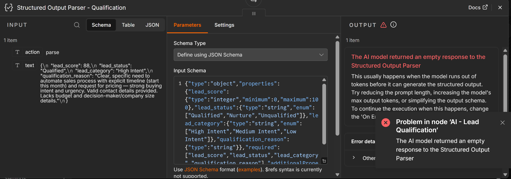
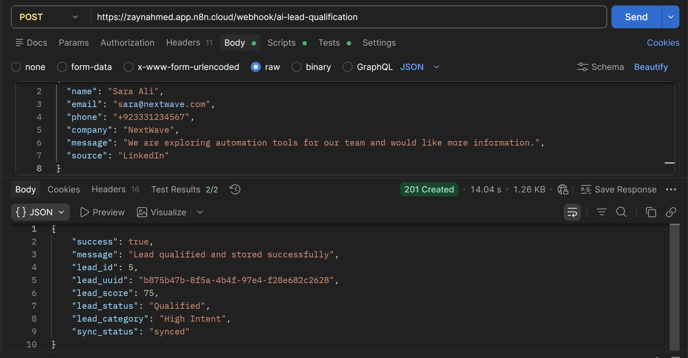
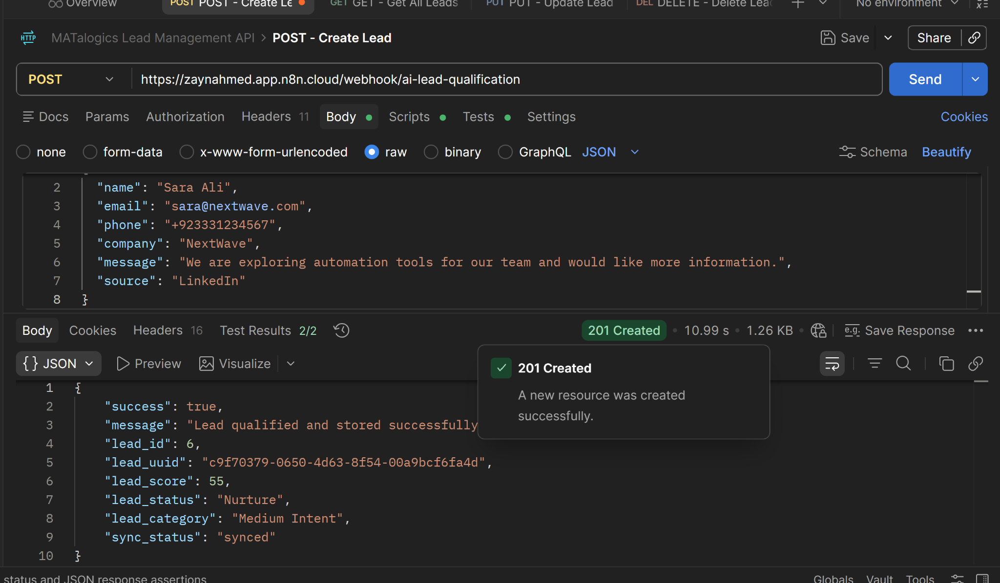
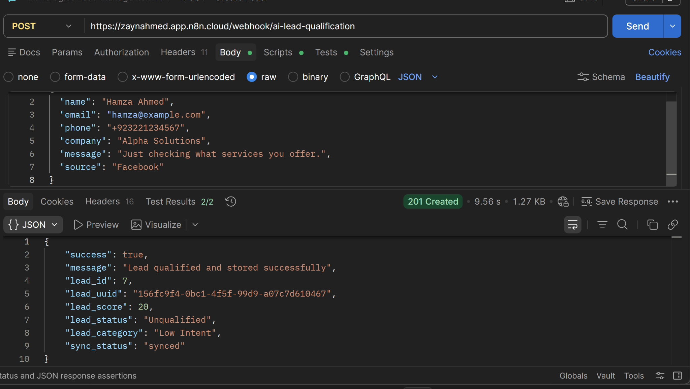
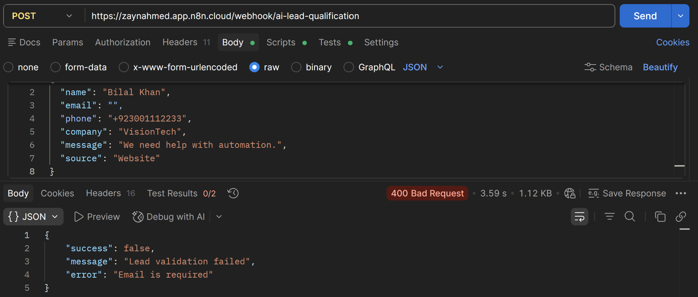
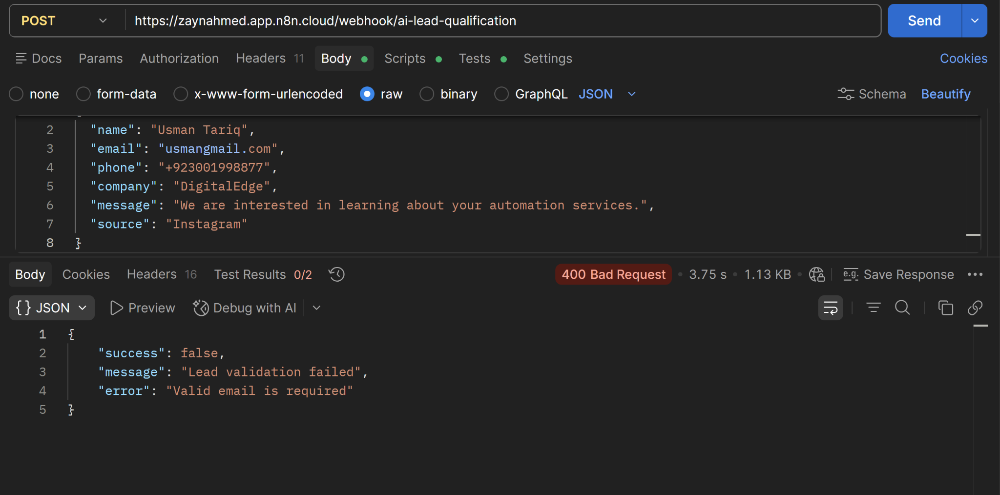
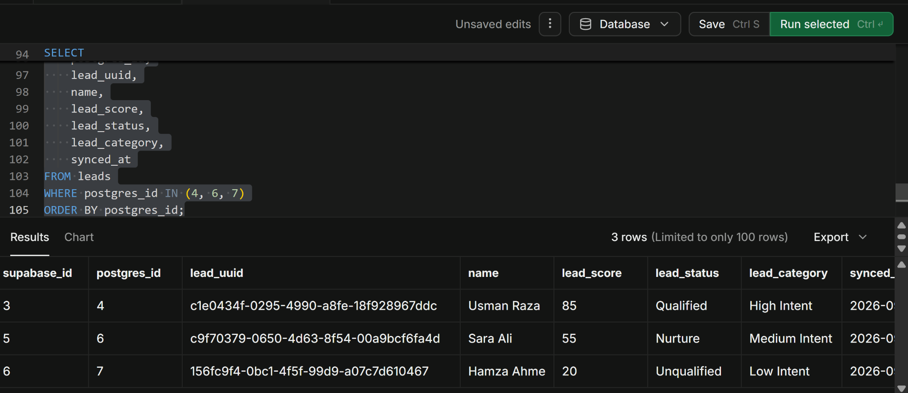
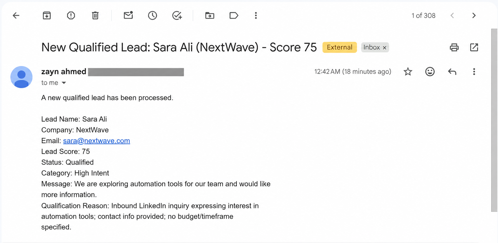

# AI Lead Qualification + Database — n8n Automation

## Project Overview

This project implements an end-to-end **AI Lead Qualification + Database Automation** using **n8n Cloud**, **Neon PostgreSQL**, **Supabase**, an **OpenAI model**, **Gmail**, and **Postman**.

The workflow receives a lead through a webhook, validates the submitted information, stores the original lead in PostgreSQL, analyzes the lead using AI, updates the same PostgreSQL record with the AI qualification result, synchronizes the enriched record to Supabase, optionally sends a notification for highly qualified leads, and returns an HTTP response to the client.

The project demonstrates a clear data movement pipeline:

```text
Webhook / Client
      ↓
     n8n
      ↓
Validation
      ↓
Neon PostgreSQL
      ↓
AI Qualification
      ↓
PostgreSQL Update
      ↓
Supabase
      ↓
PostgreSQL Sync Status Update
      ↓
IF Score >= 70
      ↓
Gmail Notification (Qualified Leads)
      ↓
HTTP Response
```

---

## Scenario

A lead enters the system with the following fields:

- Name
- Email
- Phone
- Company
- Message
- Source

The AI analyzes the lead and generates:

- `lead_score`
- `lead_status`
- `lead_category`
- `qualification_reason`

The final enriched lead is stored in both PostgreSQL and Supabase.

---

## Technologies Used

| Technology | Purpose |
|---|---|
| n8n Cloud | Workflow orchestration |
| Neon PostgreSQL | Primary database |
| Supabase | Synchronized secondary database |
| OpenAI | AI lead qualification |
| Gmail | Qualified lead notification |
| Postman | Webhook and API testing |

---

# Workflow Architecture

## Main Workflow

```text
Webhook - Receive Lead
        ↓
Normalize Lead Data
        ↓
Validate Lead
        ↓
IF - Lead Valid?
   ├── FALSE → Respond - Invalid Lead (HTTP 400)
   │
   └── TRUE
          ↓
PostgreSQL - Insert Original Lead
          ↓
AI - Lead Qualification
          ↓
Structured Output Parser - Qualification
          ↓
Validate AI Qualification
          ↓
PostgreSQL - Update AI Analysis
          ↓
Supabase - Sync Enriched Lead
          ↓
PostgreSQL - Mark Synced
          ↓
IF - Score >= 70
   ├── TRUE → Qualified Lead Notification → HTTP 201
   └── FALSE ─────────────────────────────→ HTTP 201
```

---

# Workflow Nodes

## 1. Webhook - Receive Lead

Receives a lead through an HTTP `POST` request.

**Path**

```text
ai-lead-qualification
```

Expected request body:

```json
{
  "name": "Usman Raza",
  "email": "usman@growthtech.com",
  "phone": "+923001234567",
  "company": "GrowthTech",
  "message": "We are looking to automate our sales process and want to start this month. Please contact us with pricing.",
  "source": "Website"
}
```

---

## 2. Normalize Lead Data

An n8n **Edit Fields / Set** node extracts and trims:

- name
- email
- phone
- company
- message
- source

This creates a clean and predictable input structure for validation.

---

## 3. Validate Lead

A Code node validates all required fields.

Required:

- `name`
- `email`
- `phone`
- `company`
- `message`
- `source`

It also validates the email using a basic email pattern.

Example logic:

```javascript
const data = $input.item.json;

const required = [
  'name',
  'email',
  'phone',
  'company',
  'message',
  'source'
];

let error = null;

for (const field of required) {
  const value = data[field] == null ? '' : String(data[field]).trim();

  if (value === '') {
    error =
      field.charAt(0).toUpperCase() +
      field.slice(1) +
      ' is required';

    break;
  }
}

if (!error) {
  const emailRegex = /^[^\s@]+@[^\s@]+\.[^\s@]+$/;

  if (!emailRegex.test(String(data.email).trim())) {
    error = 'Valid email is required';
  }
}

return {
  ...data,
  is_valid: error === null,
  validation_error: error
};
```

---

## 4. IF - Lead Valid?

Checks:

```text
is_valid = true
```

### TRUE

Continue with database insertion and AI qualification.

### FALSE

Return:

```json
{
  "success": false,
  "message": "Lead validation failed",
  "error": "Validation error"
}
```

HTTP status:

```text
400 Bad Request
```

Invalid leads do not reach:

- PostgreSQL
- AI
- Supabase

---

# PostgreSQL Database

PostgreSQL is the **primary database**.

The lead is first saved before AI analysis.

## PostgreSQL Table

```sql
CREATE TABLE IF NOT EXISTS leads (
    id BIGSERIAL PRIMARY KEY,

    lead_uuid UUID NOT NULL DEFAULT gen_random_uuid() UNIQUE,

    name VARCHAR(150) NOT NULL,
    email VARCHAR(255) NOT NULL,
    phone VARCHAR(50) NOT NULL,
    company VARCHAR(200) NOT NULL,
    message TEXT NOT NULL,
    source VARCHAR(100) NOT NULL,

    lead_score INTEGER
        CHECK (
            lead_score IS NULL
            OR (lead_score >= 0 AND lead_score <= 100)
        ),

    lead_status VARCHAR(30) NOT NULL DEFAULT 'Pending'
        CHECK (
            lead_status IN (
                'Pending',
                'Qualified',
                'Nurture',
                'Unqualified'
            )
        ),

    lead_category VARCHAR(30)
        CHECK (
            lead_category IS NULL
            OR lead_category IN (
                'High Intent',
                'Medium Intent',
                'Low Intent'
            )
        ),

    qualification_reason TEXT,

    ai_analyzed_at TIMESTAMPTZ,

    sync_status VARCHAR(20) NOT NULL DEFAULT 'pending'
        CHECK (
            sync_status IN (
                'pending',
                'synced',
                'failed'
            )
        ),

    created_at TIMESTAMPTZ NOT NULL DEFAULT NOW(),
    updated_at TIMESTAMPTZ NOT NULL DEFAULT NOW()
);
```

---

# Insert Original Lead into PostgreSQL

The original lead is inserted before the AI is called.

```sql
INSERT INTO leads (
    name,
    email,
    phone,
    company,
    message,
    source,
    lead_score,
    lead_status,
    lead_category,
    qualification_reason,
    ai_analyzed_at,
    sync_status,
    created_at,
    updated_at
)
VALUES (
    $1,
    $2,
    $3,
    $4,
    $5,
    $6,
    NULL,
    'Pending',
    NULL,
    NULL,
    NULL,
    'pending',
    NOW(),
    NOW()
)
RETURNING
    id,
    lead_uuid,
    name,
    email,
    phone,
    company,
    message,
    source,
    lead_score,
    lead_status,
    lead_category,
    qualification_reason,
    ai_analyzed_at,
    sync_status,
    created_at,
    updated_at;
```

Parameterized queries are used instead of directly concatenating webhook input into SQL.

---

# AI Lead Qualification

The workflow uses an OpenAI model through n8n.

The AI analyzes:

- clarity of requirement
- urgency
- buying intent
- business need
- company context
- completeness of information
- source context

---

# AI Scoring Logic

## High Intent

```text
Score: 70–100
Status: Qualified
Category: High Intent
```

Used when the lead shows strong signals such as:

- asks for pricing
- asks for a quote
- requests a demo
- provides an implementation timeline
- wants to start soon
- describes an active business need
- shows urgency

---

## Medium Intent

```text
Score: 40–69
Status: Nurture
Category: Medium Intent
```

Used when the lead:

- is exploring options
- asks for more information
- shows general business interest
- is researching possible solutions
- does not provide urgency or a purchase timeline

---

## Low Intent

```text
Score: 0–39
Status: Unqualified
Category: Low Intent
```

Used when the lead:

- is casually browsing
- asks general questions
- shows no clear business need
- shows weak or no buying intent

---

# Final AI Prompt

```text
You are an AI lead qualification system.

Analyze only the information provided in the lead.

Return:
- lead_score
- lead_status
- lead_category
- qualification_reason

SCORING RULES:

70–100 = Qualified / High Intent

Use this range only when the lead shows strong buying intent, such as:
- asking for pricing or a quote
- requesting a demo or meeting
- asking to start soon
- giving a specific implementation timeline
- clearly describing an active business problem
- showing urgency or readiness to purchase

40–69 = Nurture / Medium Intent

Use this range when the lead:
- is exploring options
- asks for more information
- shows general business interest
- is researching solutions
- describes a possible need but gives no urgency or purchase timeline
- does not ask for pricing, demo, quote, or immediate action

0–39 = Unqualified / Low Intent

Use this range when the lead:
- is only casually browsing
- asks very general questions
- shows no clear business need
- shows no buying intent
- provides vague or weak interest

IMPORTANT:

The phrase "exploring automation tools" or "would like more information"
by itself MUST NOT be treated as High Intent.

A lead must show clear purchase readiness, urgency, timeline,
pricing interest, demo interest, or a specific active business problem
before assigning a score of 70 or higher.

Allowed status values:
- Qualified
- Nurture
- Unqualified

Allowed category values:
- High Intent
- Medium Intent
- Low Intent

Score mapping must always be:

70–100:
Qualified
High Intent

40–69:
Nurture
Medium Intent

0–39:
Unqualified
Low Intent

Do not invent missing information.
Keep qualification_reason concise.
Return only the structured output required by the parser.
```

---

# Structured Output Schema

```json
{
  "type": "object",
  "properties": {
    "lead_score": {
      "type": "integer",
      "minimum": 0,
      "maximum": 100
    },
    "lead_status": {
      "type": "string",
      "enum": [
        "Qualified",
        "Nurture",
        "Unqualified"
      ]
    },
    "lead_category": {
      "type": "string",
      "enum": [
        "High Intent",
        "Medium Intent",
        "Low Intent"
      ]
    },
    "qualification_reason": {
      "type": "string"
    }
  },
  "required": [
    "lead_score",
    "lead_status",
    "lead_category",
    "qualification_reason"
  ],
  "additionalProperties": false
}
```

---


## Structured Output Parser Issue Encountered During Testing

During the first full test, the Structured Output Parser returned an error indicating that the AI model produced an empty parser response. The schema itself was valid, but the AI prompt was too verbose for reliable structured parsing in that execution.



The issue was resolved by simplifying the AI prompt while keeping the JSON schema unchanged. After the prompt was shortened and the scoring instructions were made more explicit, structured output worked correctly.

---

# Validate AI Qualification

A Code node ensures that the final AI output remains consistent.

Rules:

```text
Score >= 70
→ Qualified
→ High Intent

Score >= 40 and < 70
→ Nurture
→ Medium Intent

Score < 40
→ Unqualified
→ Low Intent
```

This prevents inconsistent AI output such as:

```text
Score = 85
Status = Unqualified
```

---

# Update PostgreSQL with AI Analysis

The same PostgreSQL record is updated after AI qualification.

```sql
UPDATE leads
SET
    lead_score = $1,
    lead_status = $2,
    lead_category = $3,
    qualification_reason = $4,
    ai_analyzed_at = NOW(),
    updated_at = NOW()
WHERE lead_uuid = $5
RETURNING
    id,
    lead_uuid,
    name,
    email,
    phone,
    company,
    message,
    source,
    lead_score,
    lead_status,
    lead_category,
    qualification_reason,
    ai_analyzed_at,
    sync_status,
    created_at,
    updated_at;
```

The workflow does not create a second PostgreSQL record.

---

# Supabase Database

Supabase acts as the synchronized secondary database.

## Supabase Fields

- id
- lead_uuid
- postgres_id
- name
- email
- phone
- company
- message
- source
- lead_score
- lead_status
- lead_category
- qualification_reason
- ai_analyzed_at
- synced_at

The same PostgreSQL-generated `lead_uuid` is used in Supabase.

A separate UUID is not generated.

---

# Supabase Synchronization Mapping

| Supabase Field | Source |
|---|---|
| lead_uuid | PostgreSQL `lead_uuid` |
| postgres_id | PostgreSQL `id` |
| name | PostgreSQL name |
| email | PostgreSQL email |
| phone | PostgreSQL phone |
| company | PostgreSQL company |
| message | PostgreSQL message |
| source | PostgreSQL source |
| lead_score | AI-enriched PostgreSQL value |
| lead_status | AI-enriched PostgreSQL value |
| lead_category | AI-enriched PostgreSQL value |
| qualification_reason | AI-enriched PostgreSQL value |
| ai_analyzed_at | PostgreSQL timestamp |
| synced_at | n8n current timestamp |

---

# Mark PostgreSQL as Synced

PostgreSQL is marked as synchronized only after the Supabase operation succeeds.

```sql
UPDATE leads
SET
    sync_status = 'synced',
    updated_at = NOW()
WHERE lead_uuid = $1
RETURNING
    id,
    lead_uuid,
    name,
    email,
    phone,
    company,
    message,
    source,
    lead_score,
    lead_status,
    lead_category,
    qualification_reason,
    ai_analyzed_at,
    sync_status,
    created_at,
    updated_at;
```

---

# Qualified Lead Notification

An IF node checks:

```text
lead_score >= 70
```

If TRUE, Gmail sends a notification.

The email includes:

- Lead Name
- Company
- Email
- Lead Score
- Lead Status
- Lead Category
- Lead Message
- Qualification Reason

If FALSE, the workflow skips the Gmail node and returns the success response.

---

# Success Response

Successful requests return:

```text
HTTP 201 Created
```

Example:

```json
{
  "success": true,
  "message": "Lead qualified and stored successfully",
  "lead_id": 4,
  "lead_uuid": "c1e0434f-0295-4990-a8fe-18f928967ddc",
  "lead_score": 85,
  "lead_status": "Qualified",
  "lead_category": "High Intent",
  "sync_status": "synced"
}
```

---

# Validation Error Response

Invalid input returns:

```text
HTTP 400 Bad Request
```

Example:

```json
{
  "success": false,
  "message": "Lead validation failed",
  "error": "Email is required"
}
```

---

# Testing

Five main test cases were executed.

## Test Case 1 — High Intent / Qualified

### Input

```json
{
  "name": "Usman Raza",
  "email": "usman@growthtech.com",
  "phone": "+923001234567",
  "company": "GrowthTech",
  "message": "We are looking to automate our sales process and want to start this month. Please contact us with pricing.",
  "source": "Website"
}
```

### Actual Result

```text
HTTP Status: 201 Created
Lead Score: 85
Lead Status: Qualified
Lead Category: High Intent
Sync Status: synced
Qualified Notification: Triggered
```

### Database Result

```text
PostgreSQL ID: 4
Supabase postgres_id: 4
```

**Result: PASS**

### Evidence


---

## Test Case 2 — Medium Intent / Nurture

### Input

```json
{
  "name": "Sara Ali",
  "email": "sara@nextwave.com",
  "phone": "+923331234567",
  "company": "NextWave",
  "message": "We are exploring automation tools for our team and would like more information.",
  "source": "LinkedIn"
}
```

### Actual Result

```text
HTTP Status: 201 Created
Lead Score: 55
Lead Status: Nurture
Lead Category: Medium Intent
Sync Status: synced
Qualified Notification: Not Triggered
```

### Prompt Refinement Evidence

The first medium-intent test was scored too aggressively by the AI:



The AI prompt was then refined to require stronger buying signals before assigning a score of 70 or above. The same lead was re-tested and correctly classified as `Nurture / Medium Intent` with a score of 55:



### Database Result

```text
PostgreSQL ID: 6
Supabase postgres_id: 6
```

**Result: PASS**

---

## Test Case 3 — Low Intent / Unqualified

### Input

```json
{
  "name": "Hamza Ahmed",
  "email": "hamza@example.com",
  "phone": "+923221234567",
  "company": "Alpha Solutions",
  "message": "Just checking what services you offer.",
  "source": "Facebook"
}
```

### Actual Result

```text
HTTP Status: 201 Created
Lead Score: 20
Lead Status: Unqualified
Lead Category: Low Intent
Sync Status: synced
Qualified Notification: Not Triggered
```

### Database Result

```text
PostgreSQL ID: 7
Supabase postgres_id: 7
```

**Result: PASS**

### Evidence



---

## Test Case 4 — Missing Required Field

### Input

```json
{
  "name": "Bilal Khan",
  "email": "",
  "phone": "+923001112233",
  "company": "VisionTech",
  "message": "We need help with automation.",
  "source": "Website"
}
```

### Actual Result

```text
HTTP Status: 400 Bad Request
Error: Email is required
AI Executed: No
PostgreSQL Write: No
Supabase Write: No
```

**Result: PASS**

### Evidence



---

## Test Case 5 — Invalid Email Format

### Input

```json
{
  "name": "Usman Tariq",
  "email": "usmangmail.com",
  "phone": "+923001998877",
  "company": "DigitalEdge",
  "message": "We are interested in learning about your automation services.",
  "source": "Instagram"
}
```

### Actual Result

```text
HTTP Status: 400 Bad Request
Error: Valid email is required
AI Executed: No
PostgreSQL Write: No
Supabase Write: No
```

**Result: PASS**

### Evidence



---

# Final Test Summary

| Test Case | Expected | Actual | Result |
|---|---|---|---|
| High Intent | Qualified / High Intent | 85 / Qualified / High Intent | PASS |
| Medium Intent | Nurture / Medium Intent | 55 / Nurture / Medium Intent | PASS |
| Low Intent | Unqualified / Low Intent | 20 / Unqualified / Low Intent | PASS |
| Missing Email | HTTP 400 | HTTP 400 | PASS |
| Invalid Email | HTTP 400 | HTTP 400 | PASS |

---

# Final Database Verification

## PostgreSQL

Final Task 6 records:

| PostgreSQL ID | Lead | Score | Status | Category | Sync |
|---:|---|---:|---|---|---|
| 4 | Usman Raza | 85 | Qualified | High Intent | synced |
| 6 | Sara Ali | 55 | Nurture | Medium Intent | synced |
| 7 | Hamza Ahmed | 20 | Unqualified | Low Intent | synced |

Verification query:

```sql
SELECT
    id,
    lead_uuid,
    name,
    company,
    lead_score,
    lead_status,
    lead_category,
    qualification_reason,
    sync_status
FROM leads
ORDER BY id;
```

---

## Supabase

Final synchronized Task 6 records:

| Supabase ID | postgres_id | Lead | Score | Status | Category |
|---:|---:|---|---:|---|---|
| 3 | 4 | Usman Raza | 85 | Qualified | High Intent |
| 5 | 6 | Sara Ali | 55 | Nurture | Medium Intent |
| 6 | 7 | Hamza Ahmed | 20 | Unqualified | Low Intent |

Verification query:

```sql
SELECT
    id AS supabase_id,
    postgres_id,
    lead_uuid,
    name,
    lead_score,
    lead_status,
    lead_category,
    synced_at
FROM leads
WHERE postgres_id IN (4, 6, 7)
ORDER BY postgres_id;
```

### Supabase Cross-Database Evidence



---

# Cross-Database Synchronization

The workflow successfully preserves the same lead identity across both systems.

Example:

```text
PostgreSQL
ID: 4
lead_uuid:
c1e0434f-0295-4990-a8fe-18f928967ddc

        ↓

Supabase
postgres_id: 4
lead_uuid:
c1e0434f-0295-4990-a8fe-18f928967ddc
```

This demonstrates:

```text
n8n
 ↓
PostgreSQL
 ↓
AI Enrichment
 ↓
PostgreSQL
 ↓
Supabase
 ↓
Automation
```

---

# Credentials Overview

The workflow requires credentials for:

- Neon PostgreSQL
- Supabase
- OpenAI
- Gmail

No passwords, API keys, database passwords, OAuth tokens, or Supabase secret keys should be stored in this repository.

All credentials are configured securely inside n8n.

---

# Security and Data Integrity

The workflow includes several safety and integrity controls:

- webhook input validation
- basic email format validation
- parameterized PostgreSQL SQL queries
- controlled AI status values
- controlled AI category values
- score range enforcement
- deterministic status/category normalization
- shared UUID synchronization
- database write ordering
- sync status tracking
- invalid input rejection before AI/database operations
- no hard-coded secrets

---

# Important Design Decision

The original lead is intentionally stored in PostgreSQL **before** AI processing.

This means the project preserves both:

1. raw/original customer-submitted information
2. AI-generated qualification information

The same PostgreSQL row is enriched after AI analysis.

This makes the data lifecycle easy to audit.

---

# Screenshot Evidence

The screenshots available from the testing session are included in this project package. They cover the structured-output issue encountered during development, successful High/Medium/Low intent tests, missing/invalid email handling, Supabase cross-database verification, and the qualified-lead email notification.

The Gmail evidence is included with the sender's personal email address redacted for public repository safety:



The complete workflow configuration is preserved in the exported n8n JSON file, while SQL, mappings, and database-verification results are documented throughout this README.

---

# Project Deliverables

- [x] n8n webhook
- [x] lead normalization
- [x] field validation
- [x] email validation
- [x] PostgreSQL primary storage
- [x] original lead saved before AI
- [x] AI lead scoring
- [x] structured AI output
- [x] deterministic AI result validation
- [x] same PostgreSQL record updated
- [x] Supabase synchronization
- [x] shared lead UUID
- [x] PostgreSQL sync status
- [x] score >= 70 branch
- [x] Gmail qualified lead notification
- [x] HTTP 201 success response
- [x] HTTP 400 validation response
- [x] Postman testing
- [x] PostgreSQL verification
- [x] Supabase verification
- [x] all required test cases passed

---

# Final Status

**PROJECT STATUS: COMPLETE**

The AI Lead Qualification + Database workflow successfully:

- receives leads through an API webhook
- validates submitted information
- preserves original data in PostgreSQL
- performs AI-based lead qualification
- stores structured qualification results
- synchronizes enriched records to Supabase
- maintains shared record identity across databases
- sends notifications for high-intent leads
- rejects invalid input correctly
- returns appropriate HTTP responses

All five required functional test cases were completed successfully.

---

## Task

**Task 6 — AI Lead Qualification + Database**

**Final Result: PASS / COMPLETE**
