# Task 7 — AI Customer Conversation Memory

## Project Overview

This project implements an **AI-powered customer support agent in n8n** with **persistent conversation memory**.

Unlike a temporary chatbot session, the agent does not depend only on n8n Simple Memory, browser state, or short-lived AI context. Instead, every customer interaction is stored in **Neon PostgreSQL**, retrieved on later requests, formatted into conversation history, and supplied back to the AI agent.

The project also uses **Supabase** as a synchronized secondary database. Shared UUID values allow matching customers, conversations, and messages across PostgreSQL and Supabase.

---

## Scenario

A customer support AI agent must remember information from previous conversations, including:

- Customer name
- Previous questions
- Previous answers
- Previous conversation context
- Current conversation context

Example:

**First request**

```text
My name is Ahmed and I need help with my order.
```

**Later request**

```text
What is my name?
```

Expected result:

```text
Your name is Ahmed.
```

The answer must come from persistent database memory.

---

## Technologies

- **n8n Cloud** — workflow automation
- **Neon PostgreSQL** — primary operational and persistent memory database
- **Supabase** — synchronized secondary database
- **OpenAI Chat Model** — AI response generation
- **Postman** — webhook/API testing
- **SQL** — relational database creation and verification

---

## Architecture

```text
Client / Postman
      |
      v
Webhook - Customer Message
      |
      v
Validate Input
      |
      v
IF - Input Valid?
   |         |
   |         +--> Invalid --> Respond HTTP 400
   |
   v
PostgreSQL - Find Customer
      |
      v
IF - Customer Exists?
   |               |
   |               +--> Create Customer
   v
Use / Update Existing Customer
      |
      v
Normalize Customer
      |
      v
PostgreSQL - Find Active Conversation
      |
      v
IF - Conversation Exists?
   |               |
   |               +--> Create Conversation
   v
Use Existing Conversation
      |
      v
Normalize Conversation
      |
      v
PostgreSQL - Retrieve Conversation History
      |
      v
Format Conversation Memory
      |
      v
AI - Customer Support Agent
      |
      v
PostgreSQL - Save Customer Message
      |
      v
PostgreSQL - Save AI Response
      |
      v
PostgreSQL - Update Conversation Timestamp
      |
      v
Supabase Customer Sync
      |
      v
Supabase Conversation Sync
      |
      v
Supabase Customer Message Sync
      |
      v
Supabase AI Message Sync
      |
      v
Respond to Webhook - AI Response
```

### Full Workflow

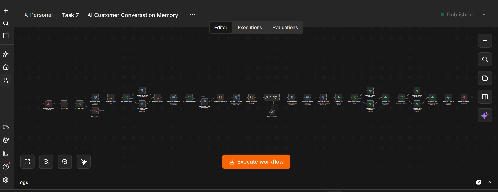

---

## Database Design

The system uses three core relational entities:

```text
CUSTOMERS
    1
    |
    +------< MANY CONVERSATIONS

CONVERSATIONS
    1
    |
    +------< MANY MESSAGES
```

---

## PostgreSQL Schema

### `customers`

| Column | Type | Purpose |
|---|---|---|
| `id` | BIGSERIAL | Primary key |
| `customer_uuid` | UUID | Shared cross-database identifier |
| `name` | VARCHAR(150) | Customer name |
| `email` | VARCHAR(255) | Unique lookup field |
| `phone` | VARCHAR(50) | Optional phone |
| `created_at` | TIMESTAMPTZ | Created timestamp |
| `updated_at` | TIMESTAMPTZ | Updated timestamp |

### `conversations`

| Column | Type | Purpose |
|---|---|---|
| `id` | BIGSERIAL | Primary key |
| `conversation_uuid` | UUID | Shared conversation identifier |
| `customer_id` | BIGINT | FK → `customers.id` |
| `status` | VARCHAR(30) | `active` / `closed` |
| `started_at` | TIMESTAMPTZ | Conversation start |
| `last_message_at` | TIMESTAMPTZ | Latest message time |
| `created_at` | TIMESTAMPTZ | Created timestamp |
| `updated_at` | TIMESTAMPTZ | Updated timestamp |

### `messages`

| Column | Type | Purpose |
|---|---|---|
| `id` | BIGSERIAL | Primary key |
| `message_uuid` | UUID | Shared message identifier |
| `conversation_id` | BIGINT | FK → `conversations.id` |
| `sender_type` | VARCHAR(20) | `customer` / `assistant` |
| `message_text` | TEXT | Message content |
| `created_at` | TIMESTAMPTZ | Message timestamp |

---

## PostgreSQL Creation SQL

```sql
CREATE TABLE IF NOT EXISTS customers (
    id BIGSERIAL PRIMARY KEY,
    customer_uuid UUID NOT NULL DEFAULT gen_random_uuid(),
    name VARCHAR(150),
    email VARCHAR(255) NOT NULL,
    phone VARCHAR(50),
    created_at TIMESTAMPTZ NOT NULL DEFAULT NOW(),
    updated_at TIMESTAMPTZ NOT NULL DEFAULT NOW(),
    CONSTRAINT customers_customer_uuid_unique UNIQUE (customer_uuid),
    CONSTRAINT customers_email_unique UNIQUE (email)
);

CREATE TABLE IF NOT EXISTS conversations (
    id BIGSERIAL PRIMARY KEY,
    conversation_uuid UUID NOT NULL DEFAULT gen_random_uuid(),
    customer_id BIGINT NOT NULL,
    status VARCHAR(30) NOT NULL DEFAULT 'active',
    started_at TIMESTAMPTZ NOT NULL DEFAULT NOW(),
    last_message_at TIMESTAMPTZ DEFAULT NOW(),
    created_at TIMESTAMPTZ NOT NULL DEFAULT NOW(),
    updated_at TIMESTAMPTZ NOT NULL DEFAULT NOW(),
    CONSTRAINT conversations_conversation_uuid_unique UNIQUE (conversation_uuid),
    CONSTRAINT conversations_customer_fk
        FOREIGN KEY (customer_id)
        REFERENCES customers(id)
        ON DELETE CASCADE,
    CONSTRAINT conversations_status_check
        CHECK (status IN ('active', 'closed'))
);

CREATE TABLE IF NOT EXISTS messages (
    id BIGSERIAL PRIMARY KEY,
    message_uuid UUID NOT NULL DEFAULT gen_random_uuid(),
    conversation_id BIGINT NOT NULL,
    sender_type VARCHAR(20) NOT NULL,
    message_text TEXT NOT NULL,
    created_at TIMESTAMPTZ NOT NULL DEFAULT NOW(),
    CONSTRAINT messages_message_uuid_unique UNIQUE (message_uuid),
    CONSTRAINT messages_conversation_fk
        FOREIGN KEY (conversation_id)
        REFERENCES conversations(id)
        ON DELETE CASCADE,
    CONSTRAINT messages_sender_type_check
        CHECK (sender_type IN ('customer', 'assistant'))
);

CREATE INDEX IF NOT EXISTS idx_customers_email
ON customers(email);

CREATE INDEX IF NOT EXISTS idx_conversations_customer_id
ON conversations(customer_id);

CREATE INDEX IF NOT EXISTS idx_conversations_status
ON conversations(status);

CREATE INDEX IF NOT EXISTS idx_conversations_last_message_at
ON conversations(last_message_at);

CREATE INDEX IF NOT EXISTS idx_messages_conversation_id
ON messages(conversation_id);

CREATE INDEX IF NOT EXISTS idx_messages_created_at
ON messages(created_at);
```

---

## Supabase Schema

Supabase mirrors the same logical entities but uses shared UUID fields for cross-database relationships.

### `customers`

- `customer_uuid` — shared UUID from PostgreSQL
- `name`
- `email`
- `phone`
- `created_at`
- `updated_at`

### `conversations`

- `conversation_uuid` — shared UUID from PostgreSQL
- `customer_uuid` — links back to Supabase customer
- `status`
- `started_at`
- `last_message_at`
- `created_at`
- `updated_at`

### `messages`

- `message_uuid` — shared UUID from PostgreSQL
- `conversation_uuid` — links to Supabase conversation
- `sender_type`
- `message_text`
- `created_at`

### Shared UUID Strategy

PostgreSQL is the source of UUID values.

The same values are reused in Supabase:

```text
PostgreSQL customer_uuid      = Supabase customer_uuid
PostgreSQL conversation_uuid  = Supabase conversation_uuid
PostgreSQL message_uuid       = Supabase message_uuid
```

This avoids unrelated duplicate identities between the two databases.

---

## Webhook Input

### Endpoint

```text
POST /webhook/customer-support-memory
```

### Valid Example

```json
{
  "name": "Ahmed",
  "email": "ahmed@example.com",
  "message": "My name is Ahmed and I need help with my order."
}
```

### Required Fields

- `email`
- `message`

### Optional Fields

- `name`
- `phone`

---

## Validation Logic

The workflow validates:

1. Email exists
2. Email has a basic valid format
3. Message exists
4. Message is not empty after trimming

Invalid requests return:

```json
{
  "success": false,
  "message": "Validation failed",
  "error": "Valid email is required"
}
```

HTTP status:

```text
400 Bad Request
```

### Validation Test Evidence

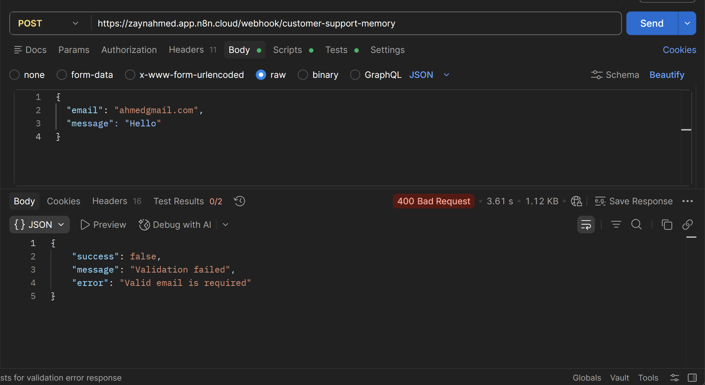

---

## Customer Lookup Logic

Customers are primarily identified by email.

```sql
SELECT
    id,
    customer_uuid,
    name,
    email,
    phone,
    created_at,
    updated_at
FROM customers
WHERE email = $1
LIMIT 1;
```

The query is parameterized and does not concatenate user input directly into SQL.

If the customer does not exist, the workflow creates one and returns the newly generated UUID.

---

## Conversation Logic

The workflow searches for the latest active conversation belonging to the customer.

```sql
SELECT
    id,
    conversation_uuid,
    customer_id,
    status,
    started_at,
    last_message_at,
    created_at,
    updated_at
FROM conversations
WHERE customer_id = $1
  AND status = 'active'
ORDER BY last_message_at DESC NULLS LAST, started_at DESC
LIMIT 1;
```

If no active conversation exists, a new one is created.

---

## Persistent Memory Logic

The key requirement of the project is that memory must come from PostgreSQL.

The workflow retrieves previous messages before generating the AI response.

```sql
SELECT
    sender_type,
    message_text,
    created_at
FROM (
    SELECT
        sender_type,
        message_text,
        created_at
    FROM messages
    WHERE conversation_id = $1
    ORDER BY created_at DESC
    LIMIT 20
) recent_messages
ORDER BY created_at ASC;
```

This retrieves the latest 20 messages and returns them in chronological order.

### PostgreSQL Retrieval Evidence

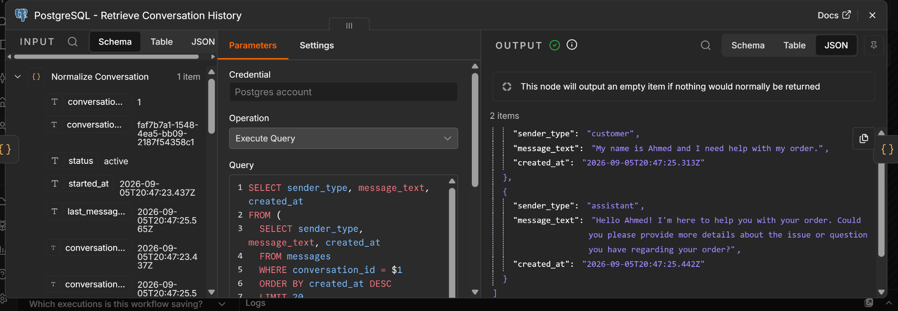

The screenshot shows that, before answering **"What is my name?"**, PostgreSQL returned:

```text
Customer: My name is Ahmed and I need help with my order.
Assistant: Hello Ahmed! I'm here to help you with your order...
```

This is direct evidence that previous messages are being retrieved from persistent storage.

---

## Conversation Memory Formatting

The retrieved database rows are converted into text such as:

```text
Customer: My name is Ahmed and I need help with my order.
Assistant: Hello Ahmed! I'm here to help you with your order.
```

The workflow also includes known customer information:

```text
KNOWN CUSTOMER INFORMATION:
Name: Ahmed
Email: ahmed@example.com
```

---

## AI Context Construction

The AI receives three major context sections:

```text
KNOWN CUSTOMER INFORMATION:
Name: Ahmed
Email: ahmed@example.com

PREVIOUS CONVERSATION FROM POSTGRESQL:
Customer: My name is Ahmed and I need help with my order.
Assistant: Hello Ahmed! ...

CURRENT CUSTOMER MESSAGE:
What is my name?
```

### AI Context Evidence

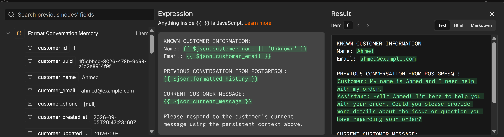

This proves that database history is explicitly supplied to the AI.

---

## AI System Behavior

The AI agent follows these rules:

- Use known customer data
- Use PostgreSQL conversation history
- Use the current customer message
- Never invent personal information
- Never invent order numbers
- Use stored history for follow-up questions
- If information is missing, say it is unavailable
- Treat PostgreSQL persistent history as the primary memory source

The workflow does not use temporary chat memory as the required source of truth.

---

## Saving Messages

### Customer Message

```sql
INSERT INTO messages (
    message_uuid,
    conversation_id,
    sender_type,
    message_text,
    created_at
)
VALUES (
    gen_random_uuid(),
    $1,
    'customer',
    $2,
    NOW()
)
RETURNING
    id,
    message_uuid,
    conversation_id,
    sender_type,
    message_text,
    created_at;
```

### AI Response

```sql
INSERT INTO messages (
    message_uuid,
    conversation_id,
    sender_type,
    message_text,
    created_at
)
VALUES (
    gen_random_uuid(),
    $1,
    'assistant',
    $2,
    NOW()
)
RETURNING
    id,
    message_uuid,
    conversation_id,
    sender_type,
    message_text,
    created_at;
```

### Update Conversation Timestamp

```sql
UPDATE conversations
SET
    last_message_at = NOW(),
    updated_at = NOW()
WHERE id = $1
RETURNING
    id,
    conversation_uuid,
    last_message_at,
    updated_at;
```

---

## Supabase Synchronization

After successful PostgreSQL writes, n8n synchronizes:

1. Customer
2. Conversation
3. Customer message
4. AI message

Existing Supabase customer/conversation records are found and updated when needed; new ones are created only if absent.

The same PostgreSQL-generated UUID values are reused in Supabase.

---

## Successful Response

Example:

```json
{
  "success": true,
  "customer_uuid": "1f5cbbcd-8026-478b-9e93-a1c2e8914f9f",
  "conversation_uuid": "faf7b7a1-1548-4ea5-bb09-2187f54358c1",
  "response": "Your name is Ahmed. How can I assist you further?"
}
```

---

## Test Cases and Results

| # | Test | Input / Scenario | Expected Result | Actual Result | Status |
|---|---|---|---|---|---|
| 1 | Invalid Email | `ahmedgmail.com` | HTTP 400, no AI/database writes | HTTP 400 returned with validation error | PASS |
| 2 | First Conversation | Ahmed introduces himself | Customer + conversation created, response generated | Successful 200 response | PASS |
| 3 | Persistent Name Memory | `"What is my name?"` | AI should answer Ahmed from DB memory | `"Your name is Ahmed."` | PASS |
| 4 | Store Order Context | `"I need help tracking order ORD-1001."` | Order detail saved | Saved and responded | PASS |
| 5 | Recall Order Context | `"Which order was I asking about?"` | AI should answer `ORD-1001` | Correctly returned `ORD-1001` | PASS |
| 6 | New Customer | Sara uses a different email | New customer and conversation | New UUIDs created | PASS |
| 7 | Customer Isolation | Sara asks which order she mentioned | Ahmed's order must not appear | AI correctly said no order information available | PASS |
| 8 | PostgreSQL Persistence | Inspect DB tables | Messages remain stored after requests | All 12 messages persisted | PASS |
| 9 | PostgreSQL Join | Join customer → conversation → messages | Correct relational history | Correct Ahmed/Sara isolation | PASS |
| 10 | Supabase Customer Sync | Compare customer UUIDs | Same UUIDs across both DBs | Exact match | PASS |
| 11 | Supabase Conversation Sync | Compare conversation UUIDs | Same UUIDs across both DBs | Exact match | PASS |
| 12 | Supabase Message Sync | Compare message UUIDs | Same UUIDs across both DBs | All 12 matched | PASS |

---

## Test Evidence

### First Conversation

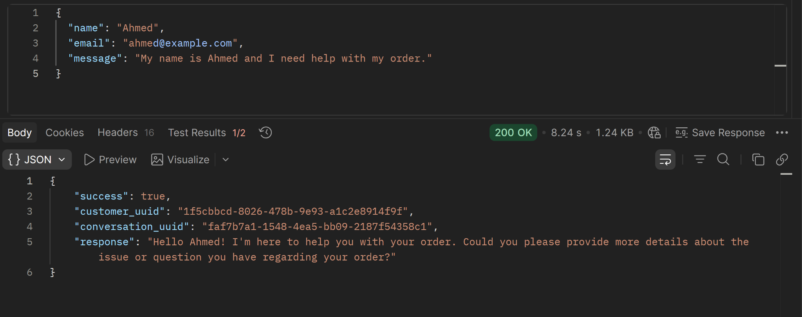

### Persistent Name Memory

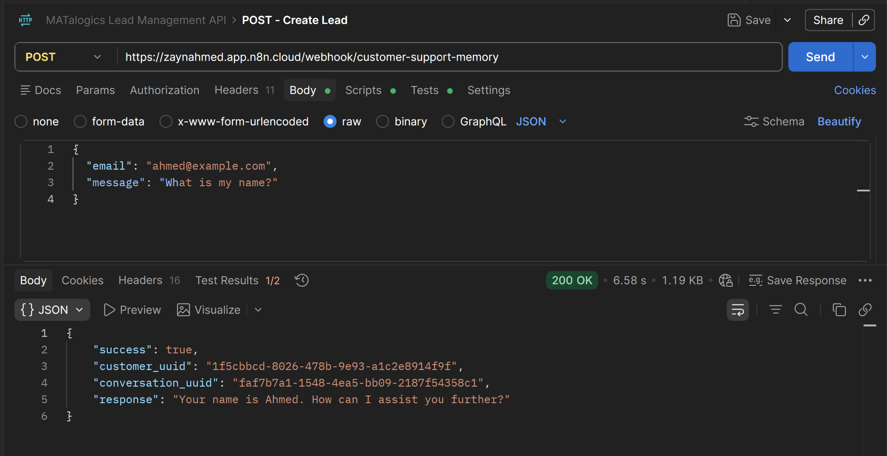

### Store Order Memory

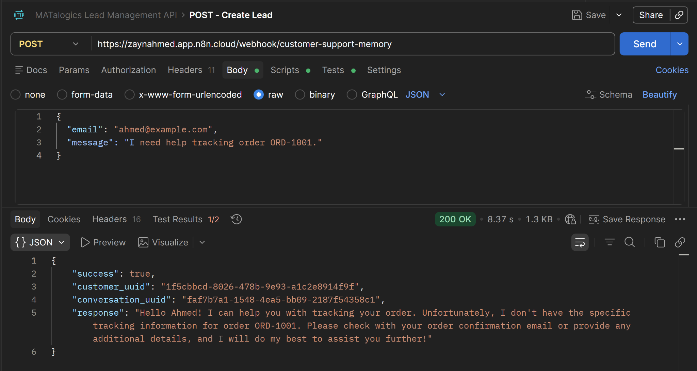

### Recall Order Memory

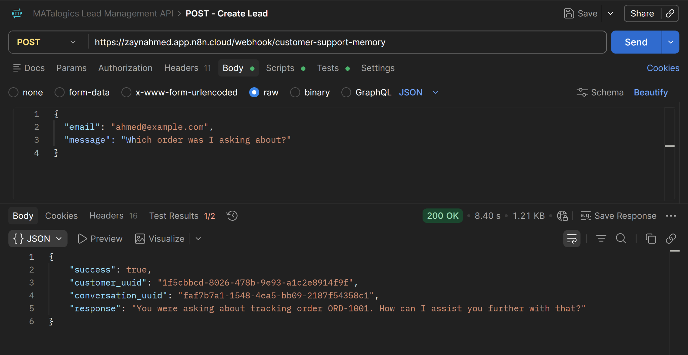

### New Customer — Sara

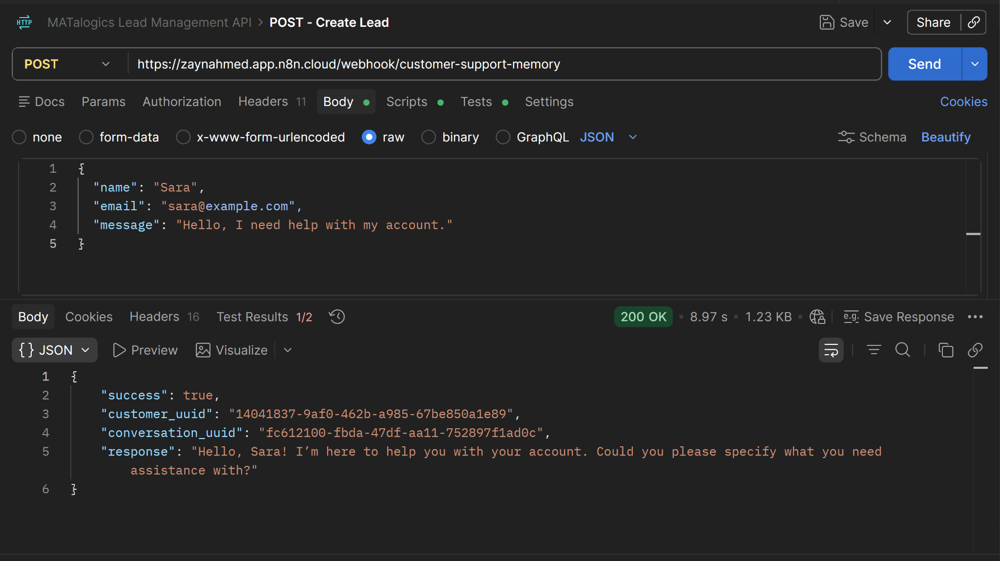

### Customer Isolation

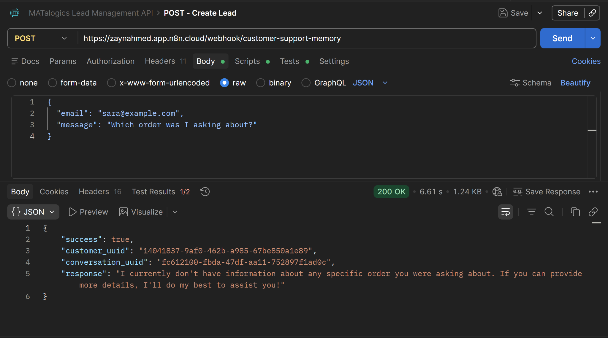

### AI Response from Persistent Memory

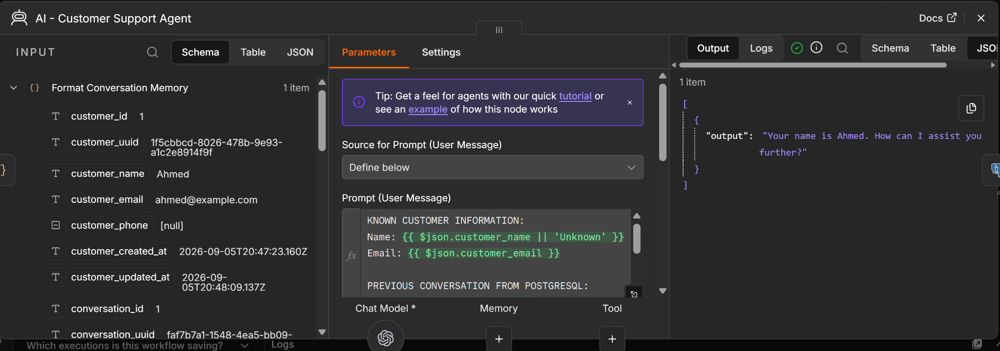

---

## PostgreSQL Verification Queries

### Customers

```sql
SELECT *
FROM customers
ORDER BY id;
```

### Conversations

```sql
SELECT *
FROM conversations
ORDER BY id;
```

### Messages

```sql
SELECT *
FROM messages
ORDER BY id;
```

### Relational Join

```sql
SELECT
    c.name,
    c.email,
    conv.conversation_uuid,
    m.sender_type,
    m.message_text,
    m.created_at
FROM customers c
JOIN conversations conv
    ON conv.customer_id = c.id
JOIN messages m
    ON m.conversation_id = conv.id
ORDER BY
    c.id,
    m.created_at;
```

---

## Verified PostgreSQL Results

### Customers

Two separate customers were successfully stored:

- **Ahmed**
  - Email: `ahmed@example.com`
  - UUID: `1f5cbbcd-8026-478b-9e93-a1c2e8914f9f`

- **Sara**
  - Email: `sara@example.com`
  - UUID: `14041837-9af0-462b-a985-67be850a1e89`

### Conversations

- Ahmed conversation:
  - `faf7b7a1-1548-4ea5-bb09-2187f54358c1`

- Sara conversation:
  - `fc612100-fbda-47df-aa11-752897f1ad0c`

### Messages

A total of **12 messages** were verified in PostgreSQL:

- 8 messages under Ahmed's conversation
- 4 messages under Sara's conversation

Both customer and assistant messages were stored.

---

## Verified Supabase Results

### Customers

Supabase contains the same customer UUIDs as PostgreSQL.

### Conversations

Supabase contains the same conversation UUIDs as PostgreSQL.

### Messages

All 12 messages were synchronized to Supabase with matching:

- `message_uuid`
- `conversation_uuid`
- `sender_type`
- `message_text`
- `created_at`

---

## Example Persistent Memory Proof

### Original Message

```text
My name is Ahmed and I need help with my order.
```

Stored in PostgreSQL.

### Later Message

```text
What is my name?
```

### Retrieved History

```text
Customer: My name is Ahmed and I need help with my order.
Assistant: Hello Ahmed! I'm here to help you with your order...
```

### AI Response

```text
Your name is Ahmed. How can I assist you further?
```

This proves that the AI used persisted database context.

---

## Customer Isolation Proof

Ahmed asked:

```text
I need help tracking order ORD-1001.
```

Later Ahmed asked:

```text
Which order was I asking about?
```

AI returned:

```text
ORD-1001
```

Sara then asked:

```text
Which order was I asking about?
```

AI correctly responded that no order information was available for Sara.

This proves that one customer's history is not exposed to another customer.

---

## Security Notes

- No passwords are hardcoded
- No API keys are stored in Code nodes
- No secrets are returned by the webhook
- PostgreSQL queries use `$1`, `$2`, `$3` parameter placeholders
- Customer input is treated as data
- Supabase identities are synchronized through shared UUIDs
- Invalid requests do not proceed to AI or database writes

---

## Data Flow

```text
n8n
  |
  v
Neon PostgreSQL
  |
  +--> Customers
  +--> Conversations
  +--> Messages
  |
  v
Persistent Conversation Memory
  |
  v
AI Agent
  |
  v
Neon PostgreSQL
  |
  v
Supabase Synchronization
  |
  v
Webhook Response
```

---

## Key Learning Outcome

This project demonstrates the difference between **temporary AI memory** and **persistent database-backed memory**.

The AI can answer follow-up questions because n8n:

1. Identifies the customer
2. Finds the active conversation
3. Retrieves previous PostgreSQL messages
4. Formats the stored history
5. Sends the history to the AI
6. Saves the new customer message
7. Saves the AI response
8. Synchronizes the same records to Supabase

---

## Deliverables Completed

- [x] Full n8n workflow
- [x] Webhook endpoint
- [x] Validation logic
- [x] PostgreSQL customers table
- [x] PostgreSQL conversations table
- [x] PostgreSQL messages table
- [x] Customer lookup
- [x] Conversation lookup
- [x] Persistent message retrieval
- [x] AI context construction
- [x] Customer message persistence
- [x] AI response persistence
- [x] Supabase synchronization
- [x] Shared UUID strategy
- [x] Invalid email test
- [x] First conversation test
- [x] Customer name memory test
- [x] Order memory test
- [x] New customer test
- [x] Customer isolation test
- [x] PostgreSQL verification
- [x] Supabase verification
- [x] PASS/FAIL test table
- [x] Screenshots
- [x] Workflow JSON export
- [x] Final README

---

## Final Project Status

**Status: COMPLETED — ALL REQUIRED TESTS PASSED**

The final system successfully demonstrates persistent AI customer conversation memory using:

```text
n8n
↓
PostgreSQL
↓
Persistent Conversation Memory
↓
AI Agent
↓
PostgreSQL
↓
Supabase
```

The AI correctly remembers customer information and prior conversation details from PostgreSQL while maintaining customer-level data isolation and synchronized Supabase records.
