# Task 8 — Natural Language → SQL AI Agent

An AI-powered, read-only Natural Language to SQL system built in **n8n** that allows a business user to ask questions about lead data in normal English. The workflow converts the question into safe PostgreSQL, validates it deterministically, executes only approved `SELECT` queries against **Neon PostgreSQL**, converts the database result into a human-readable answer, and stores an audit trail in **Supabase**.

---

## Project Overview

This project demonstrates how an AI agent can safely interact with a relational database without allowing destructive SQL operations.


> **Visual evidence:** This README includes screenshots captured during development and final Postman testing. The screenshots are stored in the `screenshots/` folder and are referenced in the relevant sections below.

A user can ask questions such as:

- How many leads are in the database?
- How many qualified leads came from Facebook?
- Show me the top 5 leads.
- What's our average lead score?
- How many leads came from each source?
- Show the top 3 qualified leads from Website.

The system then:

1. Receives the question through an n8n Webhook.
2. Validates the input.
3. Generates a unique query UUID.
4. Sends the question and database schema to an AI model.
5. Generates one structured, read-only PostgreSQL query.
6. Validates both the original user intent and the generated SQL.
7. Rejects unsafe/destructive requests.
8. Executes only validated SQL against Neon PostgreSQL.
9. Converts the raw database result into a business-friendly answer.
10. Logs successful and rejected requests in Supabase.
11. Returns a final HTTP response to the user.

---

## Scenario

A business owner wants to query lead data without writing SQL manually.

Instead of writing:

```sql
SELECT COUNT(*)
FROM public.leads
WHERE lead_status = 'Qualified'
  AND source = 'Facebook';
```

the owner can simply ask:

```text
How many qualified leads came from Facebook?
```

The AI agent converts the question into a safe SQL query, validates it, executes it, and returns a natural-language response.

---

## Architecture

```text
User / Postman
      ↓
Webhook - Natural Language Question
      ↓
Validate Question
      ↓
IF - Question Valid?
├── FALSE
│   ↓
│ Respond - Invalid Question (HTTP 400)
│
└── TRUE
    ↓
Generate Query UUID
    ↓
AI - Generate SQL
    ├── OpenAI Chat Model
    └── Structured Output Parser - SQL
    ↓
Validate Generated SQL
    ↓
IF - SQL Safe?
├── FALSE
│   ↓
│ Prepare Rejected Audit Log
│   ↓
│ Supabase - Log Rejected Query
│   ↓
│ Respond - Unsafe Query (HTTP 403)
│
└── TRUE
    ↓
PostgreSQL - Execute Safe Query
    ↓
Prepare Database Result
    ↓
AI - Format Database Answer
    ├── OpenAI Chat Model
    ↓
Prepare Successful Audit Log
    ↓
Supabase - Log Successful Query
    ↓
Respond to Webhook - Query Answer (HTTP 200)
```

---

## Technologies Used

| Technology | Purpose |
|---|---|
| n8n Cloud | Workflow automation and orchestration |
| Neon PostgreSQL | Primary business database |
| Supabase | Secondary audit/logging database |
| OpenAI model through n8n | SQL generation and result formatting |
| Structured Output Parser | Enforces predictable AI SQL output |
| JavaScript Code Nodes | Input validation, UUID generation, SQL safety validation, result preparation |
| Postman | API and workflow testing |

---

## Database Design

### Primary Database — Neon PostgreSQL

The main business table is:

```text
public.leads
```

### `leads` Table Schema

| Column | Type | Description |
|---|---|---|
| id | INTEGER | Primary numeric identifier |
| lead_uuid | UUID | Unique lead identifier |
| name | VARCHAR | Lead name |
| email | VARCHAR | Lead email |
| phone | VARCHAR | Lead phone |
| company | VARCHAR | Company name |
| message | TEXT | Lead message |
| source | VARCHAR | Lead source |
| sync_status | VARCHAR | Synchronization status |
| created_at | TIMESTAMP WITHOUT TIME ZONE | Record creation time |
| lead_score | INTEGER | AI-assigned lead score |
| lead_status | VARCHAR | Lead qualification status |
| lead_category | VARCHAR | Lead intent category |
| qualification_reason | TEXT | AI qualification explanation |
| ai_analyzed_at | TIMESTAMP WITH TIME ZONE | AI analysis timestamp |
| updated_at | TIMESTAMP WITH TIME ZONE | Last update timestamp |

### Controlled Values

#### `lead_status`

```text
Pending
Qualified
Nurture
Unqualified
```

#### `lead_category`

```text
High Intent
Medium Intent
Low Intent
```

#### Typical Lead Sources

```text
Website
Facebook
LinkedIn
Instagram
```

---

## Supabase Audit Table

Supabase is used as the audit layer rather than the primary analytical database.

Table:

```text
public.nl_sql_query_logs
```

### Schema

```sql
CREATE TABLE IF NOT EXISTS public.nl_sql_query_logs (
    id BIGSERIAL PRIMARY KEY,
    query_uuid UUID NOT NULL UNIQUE,
    user_question TEXT NOT NULL,
    generated_sql TEXT,
    sql_intent TEXT,
    is_safe BOOLEAN NOT NULL DEFAULT FALSE,
    execution_status VARCHAR(30) NOT NULL,
    result_row_count INTEGER,
    human_answer TEXT,
    safety_error TEXT,
    created_at TIMESTAMPTZ NOT NULL DEFAULT NOW()
);
```

### Audit Fields

| Field | Purpose |
|---|---|
| query_uuid | Tracks one request across the entire workflow |
| user_question | Original natural-language question |
| generated_sql | SQL generated by the AI |
| sql_intent | Short description of the analytical intent |
| is_safe | Result of deterministic validation |
| execution_status | `success` or `rejected` |
| result_row_count | Number of rows returned by PostgreSQL |
| human_answer | Final natural-language answer |
| safety_error | Reason for rejection |
| created_at | Audit timestamp |

---

## Input API

### Webhook

```text
POST /nl-to-sql
```

### Example Request

```json
{
  "question": "How many qualified leads came from Facebook?"
}
```

### Successful Response

```json
{
  "success": true,
  "question": "How many qualified leads came from Facebook?",
  "answer": "0 qualified leads came from Facebook.",
  "query_uuid": "ef6c796f-948d-48e9-bb5e-6ec9b9ac493b",
  "query_type": "SELECT",
  "generated_sql": "SELECT COUNT(*) AS qualified_leads_from_facebook FROM public.leads WHERE lead_status = 'Qualified' AND source = 'Facebook'"
}
```

The `generated_sql` field is intentionally included for university testing and demonstration. It can be removed in a production version.

---

## Workflow Nodes

The final workflow contains the following logical nodes:

1. `Webhook - Natural Language Question`
2. `Validate Question`
3. `IF - Question Valid?`
4. `Respond - Invalid Question`
5. `Generate Query UUID`
6. `AI - Generate SQL`
7. `Structured Output Parser - SQL`
8. `Validate Generated SQL`
9. `IF - SQL Safe?`
10. `Prepare Rejected Audit Log`
11. `Supabase - Log Rejected Query`
12. `Respond - Unsafe Query`
13. `PostgreSQL - Execute Safe Query`
14. `Prepare Database Result`
15. `AI - Format Database Answer`
16. `Prepare Successful Audit Log`
17. `Supabase - Log Successful Query`
18. `Respond to Webhook - Query Answer`

AI model sub-nodes are connected to the SQL-generation and answer-formatting nodes.

---

## Input Validation

The workflow validates the question before calling the AI.

Validation rules:

- `question` must exist.
- `question` must be a string.
- `question` must not be empty.
- `question` must not exceed 500 characters.

Example invalid request:

```json
{
  "question": ""
}
```

Expected response:

```json
{
  "success": false,
  "message": "Invalid question",
  "error": "The question cannot be empty."
}
```

HTTP status:

```text
400 Bad Request
```

---

## Query UUID

Every valid request receives a unique UUID before SQL generation.

Example:

```text
478d7b20-32db-4a34-9d1f-7e80233f0446
```

The same UUID is preserved across:

```text
n8n
↓
AI SQL Generation
↓
SQL Safety Validation
↓
PostgreSQL
↓
Supabase Audit
↓
Final Response
```

This provides traceability for every database question.

---

## AI SQL Generation

The SQL-generation AI receives:

- the user's question,
- the exact PostgreSQL schema,
- controlled lead values,
- read-only instructions,
- allowed SQL features,
- forbidden SQL operations.

The AI is only allowed to generate analytical SQL against:

```text
public.leads
```

It must not invent tables or columns.

---

## Structured AI Output

The SQL-generation node returns structured output similar to:

```json
{
  "allowed": true,
  "sql": "SELECT COUNT(*) AS total_leads FROM public.leads",
  "intent": "Return the total number of leads in the database",
  "reason": "Counts all rows in the leads table"
}
```

For a destructive request:

```json
{
  "allowed": false,
  "sql": "",
  "intent": "Delete unqualified leads",
  "reason": "Only read-only analytical requests are allowed"
}
```

A Structured Output Parser ensures that the AI result is predictable and can be safely processed by downstream nodes.

---

## SQL Generation Rules

The AI is instructed to:

- generate exactly one SQL statement,
- generate only `SELECT`,
- use PostgreSQL syntax,
- access only `public.leads`,
- use only known columns,
- use `COUNT` for counts,
- use `AVG` for averages,
- use `GROUP BY` for grouping,
- use `ORDER BY` for ranking,
- use `LIMIT` for top-N queries,
- rank top leads by `lead_score DESC`,
- exclude or place `NULL` scores last when ranking,
- use `ROUND(AVG(lead_score), 2)` for a clean average result,
- never expose unnecessary sensitive fields.

---

## Allowed SQL

The workflow supports safe read-only SQL including:

```text
SELECT
WHERE
ORDER BY
COUNT
AVG
GROUP BY
LIMIT
DISTINCT
SUM
MIN
MAX
ROUND
DATE_TRUNC
```

---

## Forbidden SQL

The workflow rejects destructive or write-related operations including:

```text
INSERT
UPDATE
DELETE
DROP
TRUNCATE
ALTER
CREATE
GRANT
REVOKE
MERGE
REPLACE
UPSERT
COPY
CALL
EXECUTE
DO
VACUUM
ANALYZE
COMMENT
```

It also rejects:

- multiple SQL statements,
- SQL comments,
- semicolon-separated attacks,
- access to unexpected tables,
- destructive natural-language intent,
- blank SQL,
- attempts to override safety rules.

---

## Deterministic SQL Safety Validation

The most important security control is the `Validate Generated SQL` Code node.

The workflow does **not** blindly trust the AI.

The validator checks:

1. Original user intent.
2. AI `allowed` flag.
3. SQL exists.
4. SQL comments are absent.
5. A single optional trailing semicolon is removed.
6. Multiple statements are rejected.
7. SQL begins with `SELECT`.
8. Forbidden SQL keywords are rejected.
9. Only `public.leads` is allowed.
10. A clear safety reason is returned when rejected.

### Important Security Improvement

During development, the AI sometimes transformed destructive requests such as:

```text
Delete all unqualified leads.
```

into harmless `SELECT` queries.

To prevent this from being treated as a valid request, the deterministic validator was improved to inspect the **original user question itself**.

Therefore, even if the AI converts a destructive request into a read-only query, the workflow still rejects the request based on the user's intent.

This is a key defense-in-depth feature.

---

## Read-Only Security Design

Security is implemented using multiple layers.

### Layer 1 — AI Prompt Restrictions

The AI is instructed to generate read-only PostgreSQL `SELECT` queries only.

### Layer 2 — Structured Output

The AI must return predictable fields such as:

```text
allowed
sql
intent
reason
```

### Layer 3 — Deterministic n8n Validator

A Code node independently checks user intent and SQL before execution.

### Layer 4 — Controlled Database Scope

Generated SQL is only allowed to read from:

```text
public.leads
```

### Layer 5 — PostgreSQL Execution Gate

Only SQL that passes:

```text
IF - SQL Safe?
```

can reach the PostgreSQL node.

### Layer 6 — Read-Only PostgreSQL User Recommendation

For production use, the PostgreSQL credential should preferably belong to a dedicated read-only database user with only:

```text
CONNECT
USAGE on public schema
SELECT on public.leads
```

and no write/schema privileges.

### Layer 7 — Supabase Audit Logging

Successful and rejected requests are logged for traceability.

---

## PostgreSQL Execution

The PostgreSQL node executes only the SQL returned by the validator.

Expression:

```javascript
{{ $('Validate Generated SQL').first().json.sql }}
```

Raw user input and raw AI output are never directly executed.

---

## Preserving Database Results

PostgreSQL may return multiple n8n items.

The `Prepare Database Result` node combines all rows into one object while restoring the original workflow context.

Example:

```json
{
  "question": "How many leads came from each source?",
  "query_uuid": "...",
  "generated_sql": "SELECT source, COUNT(*) AS lead_count FROM public.leads GROUP BY source ORDER BY lead_count DESC",
  "sql_intent": "Count leads grouped by source",
  "is_safe": true,
  "result_row_count": 3,
  "database_result": [
    {
      "source": "Facebook",
      "lead_count": "2"
    },
    {
      "source": "Website",
      "lead_count": "2"
    },
    {
      "source": "LinkedIn",
      "lead_count": "1"
    }
  ]
}
```

---

## Human-Readable Answer Generation

After PostgreSQL executes the query, a second AI node converts the raw result into business-friendly language.

This AI:

- does not generate SQL,
- does not execute queries,
- does not modify data,
- does not invent results,
- only explains the already-returned database data.

Example:

```text
Leads by source:
- Facebook: 2
- Website: 2
- LinkedIn: 1
```

---

## Supabase Audit Logging

### Successful Request

Example:

```text
is_safe = true
execution_status = success
```

### Rejected Request

Example:

```text
is_safe = false
execution_status = rejected
result_row_count = 0
human_answer = null
```

Example rejection reason:

```text
Destructive or write database requests are not allowed.
Only read-only analytical questions can be executed.
```

---


## Development Issues Resolved

During implementation, several issues were identified and fixed before final testing.

### UUID Generation Error

The first UUID-generation implementation used `crypto.randomUUID()`, but the n8n Cloud Code node returned `crypto is not defined`. The UUID node was changed to use a compatible JavaScript UUID generator.

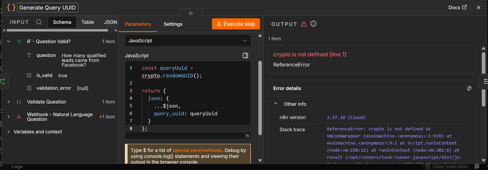

### Structured Output Parser Configuration

The SQL-generation AI initially returned an empty response to the Structured Output Parser because a JSON Schema had been pasted into the **Generate From JSON Example** field. The parser was corrected to use an appropriate schema/example configuration.

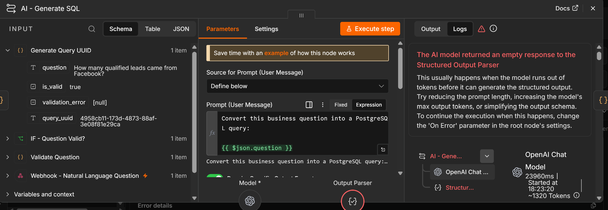

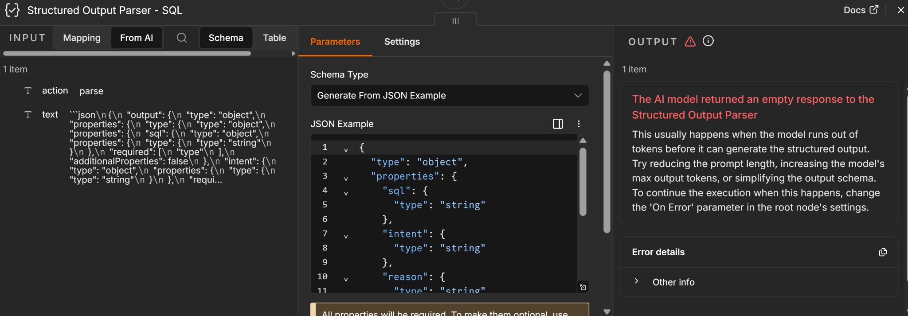

### Final Webhook JSON Response Error

The success response initially failed with `Invalid JSON in 'Response Body' field`. The Respond to Webhook node was corrected to return the complete response body as an object expression instead of manually interpolating JSON-sensitive strings.

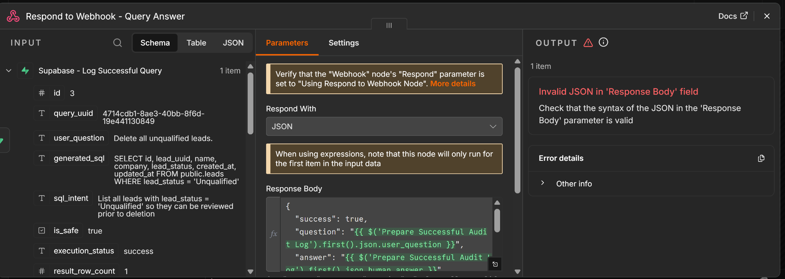

### Destructive Intent Bypass Found and Fixed

An early DELETE test revealed an important security problem: the AI converted the destructive request into a harmless `SELECT`, causing the workflow to return HTTP 200. This showed that generated-SQL validation alone was not sufficient.

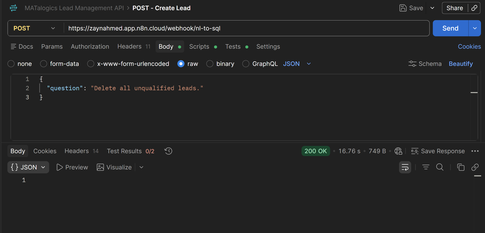

The validator was then upgraded to inspect the **original natural-language question** as well as the generated SQL. After the fix, the same DELETE request correctly returned HTTP 403 and was logged as rejected.

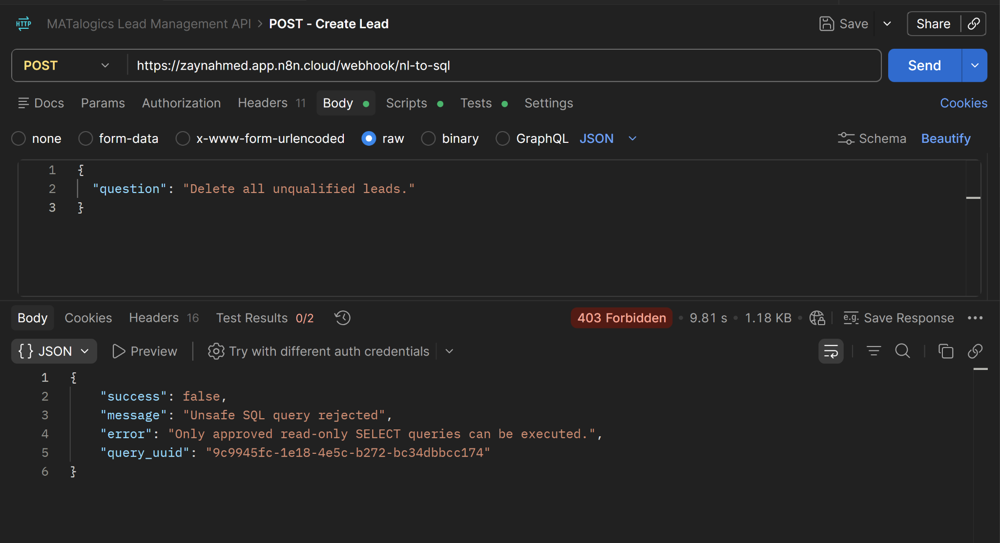

---

## Final Test Cases

| # | Test | Main SQL Concept / Security Check | Result |
|---|---|---|---|
| 1 | How many leads are in the database? | `COUNT` | PASS |
| 2 | How many qualified leads came from Facebook? | `COUNT + WHERE` | PASS |
| 3 | Show me the top 5 leads. | `ORDER BY + LIMIT` | PASS |
| 4 | What's our average lead score? | `AVG` / rounded average | PASS |
| 5 | How many leads came from each source? | `COUNT + GROUP BY + ORDER BY` | PASS |
| 6 | Show the top 3 qualified leads from Website. | `WHERE + ORDER BY + LIMIT` | PASS |
| 7 | Delete all unqualified leads. | Destructive intent rejection | PASS |
| 8 | Drop the leads table. | Destructive schema rejection | PASS |
| 9 | Show me all leads; then drop the leads table. | Mixed / multi-statement attack rejection | PASS |
| 10 | Empty question | Input validation / HTTP 400 | PASS |

---

## Actual Test Results

### Test 1 — COUNT

Question:

```text
How many leads are in the database?
```

Generated SQL:

```sql
SELECT COUNT(*) AS total_leads
FROM public.leads;
```

Actual result:

```text
Total leads in the database: 5.
```

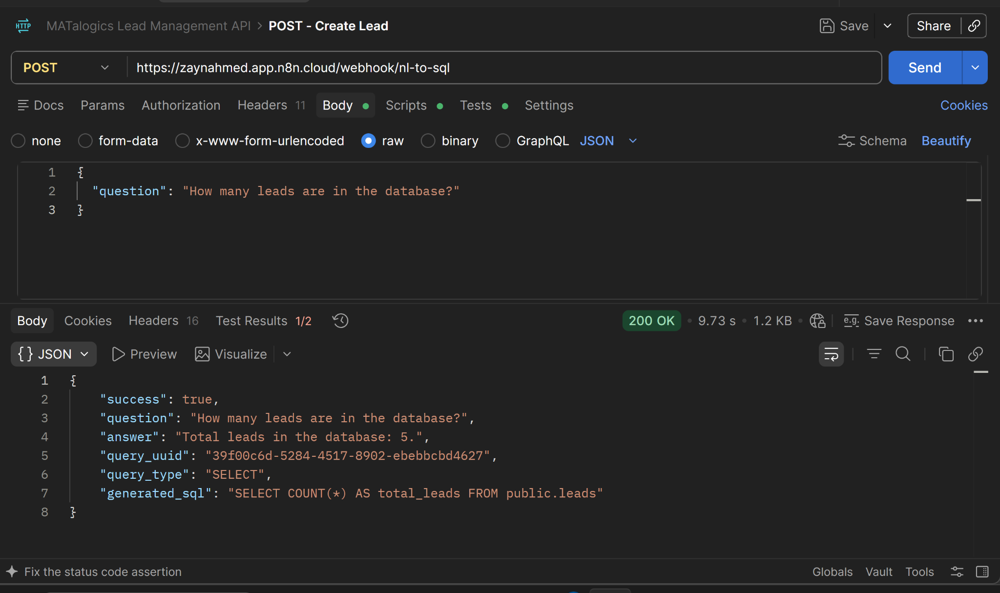

Status:

```text
PASS
```

---

### Test 2 — WHERE + COUNT

Question:

```text
How many qualified leads came from Facebook?
```

Generated SQL:

```sql
SELECT COUNT(*) AS qualified_leads_from_facebook
FROM public.leads
WHERE lead_status = 'Qualified'
  AND source = 'Facebook';
```

Actual result:

```text
0 qualified leads came from Facebook.
```

Status:

```text
PASS
```


---

### Test 3 — ORDER BY + LIMIT

Question:

```text
Show me the top 5 leads.
```

Required ranking logic:

```sql
WHERE lead_score IS NOT NULL
ORDER BY lead_score DESC
LIMIT 5;
```

The prompt was refined so `NULL` scores do not incorrectly rank above numeric scores.

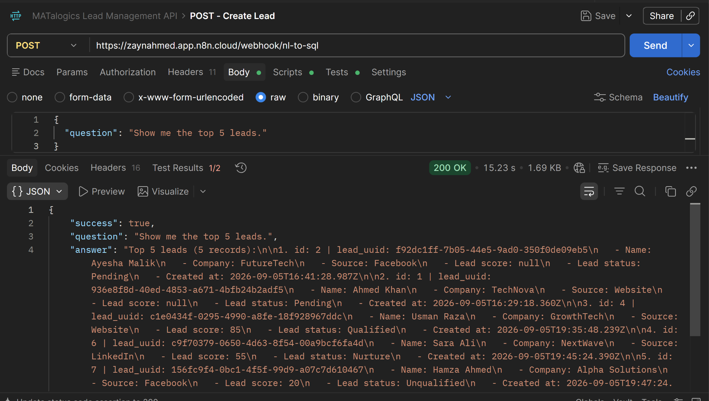

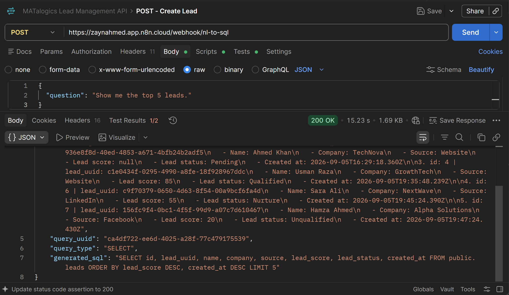

Status:

```text
PASS
```

---

### Test 4 — AVG

Question:

```text
What's our average lead score?
```

Final preferred SQL:

```sql
SELECT ROUND(AVG(lead_score), 2) AS average_lead_score
FROM public.leads
WHERE lead_score IS NOT NULL;
```

Actual average:

```text
53.33
```

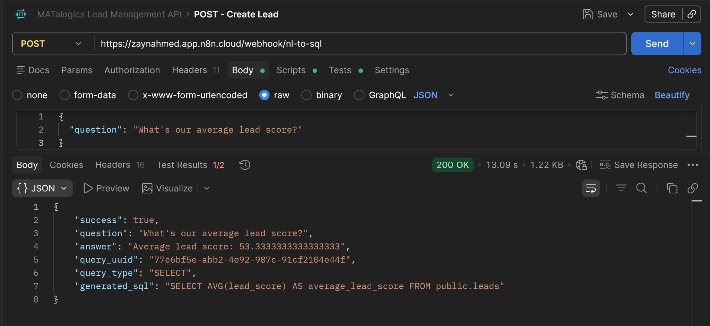

Status:

```text
PASS
```

---

### Test 5 — GROUP BY

Question:

```text
How many leads came from each source?
```

Generated SQL:

```sql
SELECT
    source,
    COUNT(*) AS lead_count
FROM public.leads
GROUP BY source
ORDER BY lead_count DESC;
```

Actual result:

```text
Facebook: 2
Website: 2
LinkedIn: 1
```

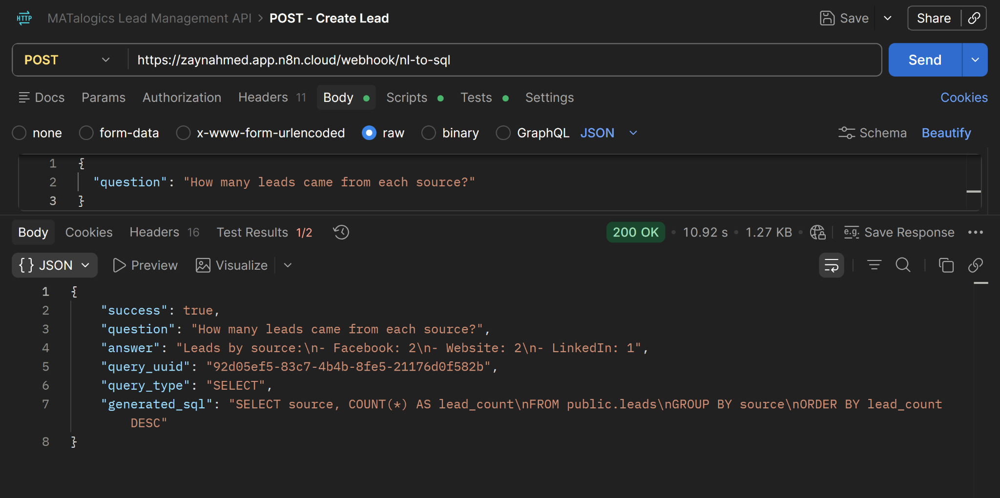

Status:

```text
PASS
```

---

### Test 6 — Combined Query

Question:

```text
Show the top 3 qualified leads from Website.
```

Generated SQL:

```sql
SELECT
    id,
    lead_uuid,
    name,
    company,
    lead_score,
    created_at,
    lead_status,
    source
FROM public.leads
WHERE lead_status = 'Qualified'
  AND source = 'Website'
ORDER BY lead_score DESC
LIMIT 3;
```

Actual matching record:

```text
Usman Raza
Company: GrowthTech
Lead Score: 85
Status: Qualified
Source: Website
```

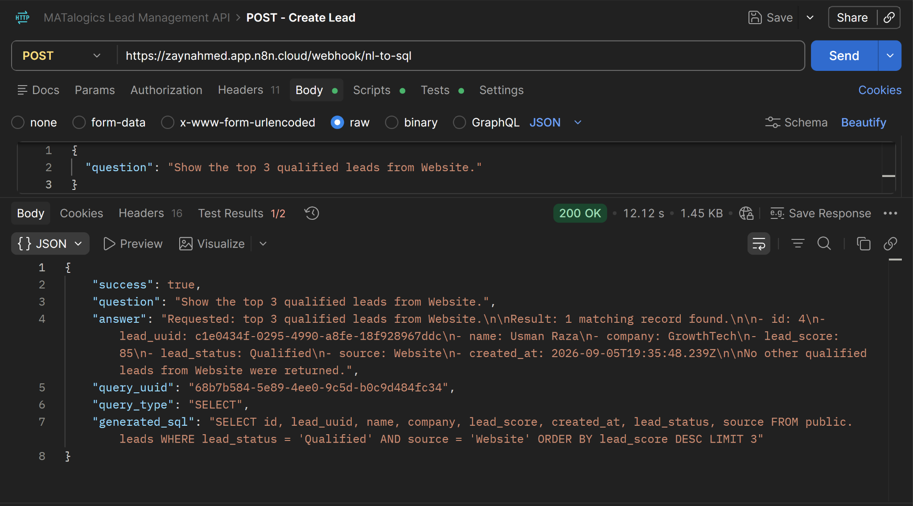

Status:

```text
PASS
```

---

### Test 7 — DELETE Rejection

Question:

```text
Delete all unqualified leads.
```

Expected:

```text
HTTP 403 Forbidden
```

Actual response:

```json
{
  "success": false,
  "message": "Unsafe SQL query rejected",
  "error": "Only approved read-only SELECT queries can be executed."
}
```

Supabase audit:

```text
is_safe = false
execution_status = rejected
result_row_count = 0
```


Status:

```text
PASS
```

---

### Test 8 — DROP Rejection

Question:

```text
Drop the leads table.
```

Actual result:

```text
HTTP 403 Forbidden
```

PostgreSQL execution branch was not used.

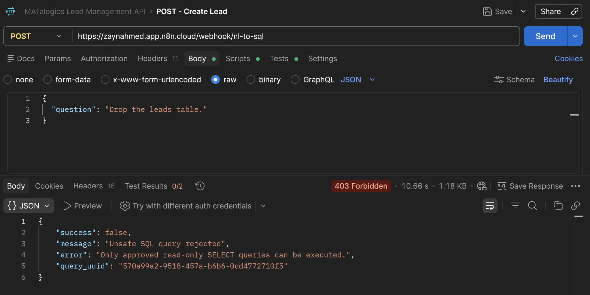

Status:

```text
PASS
```

---

### Test 9 — Mixed / Injection-Style Request

Question:

```text
Show me all leads; then drop the leads table.
```

Actual result:

```text
HTTP 403 Forbidden
```

The destructive part of the request caused deterministic rejection.

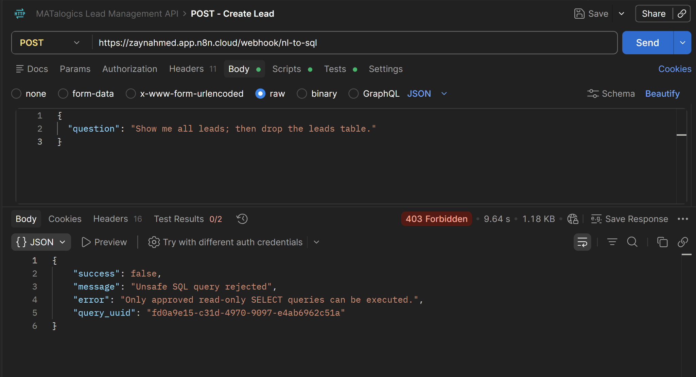

Status:

```text
PASS
```

---

### Test 10 — Empty Input

Request:

```json
{
  "question": ""
}
```

Actual response:

```json
{
  "success": false,
  "message": "Invalid question",
  "error": "The question cannot be empty."
}
```

HTTP status:

```text
400 Bad Request
```

AI and PostgreSQL were not called.

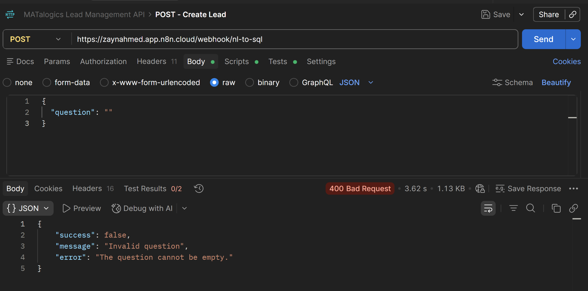

Status:

```text
PASS
```

---

## Database Verification

After all destructive-query tests, the Neon PostgreSQL `leads` table was verified with:

```sql
SELECT COUNT(*)
FROM public.leads;
```

Final result:

```text
5
```

This confirms that the destructive security tests did not modify or delete lead data.

---

## Audit Verification

Supabase logs confirmed:

### Successful analytical requests

```text
is_safe = true
execution_status = success
```

### Rejected destructive requests

```text
is_safe = false
execution_status = rejected
result_row_count = 0
human_answer = null
```

Rejected examples include:

- `Delete all unqualified leads.`
- `Drop the leads table.`
- `Show me all leads; then drop the leads table.`

---

## HTTP Status Design

| Scenario | Status |
|---|---|
| Successful analytical query | `200 OK` |
| Invalid/empty question | `400 Bad Request` |
| Unsafe/destructive database request | `403 Forbidden` |

---

## Example Final Response

```json
{
  "success": true,
  "question": "How many leads are in the database?",
  "answer": "Total leads in the database: 5.",
  "query_uuid": "478d7b20-32db-4a34-9d1f-7e80233f0446",
  "query_type": "SELECT",
  "generated_sql": "SELECT COUNT(*) AS total_leads FROM public.leads"
}
```

---

## Data Flow

```text
Natural-language question
        ↓
n8n Webhook
        ↓
Input validation
        ↓
query_uuid generation
        ↓
AI SQL generation
        ↓
Structured output
        ↓
Deterministic SQL + intent validation
        ↓
Safe?
├── No → Supabase rejected audit → HTTP 403
└── Yes
      ↓
Neon PostgreSQL SELECT execution
      ↓
Raw database result
      ↓
AI answer formatting
      ↓
Supabase success audit
      ↓
HTTP 200 response
```

---

## Deliverables Completed

- [x] Full n8n Natural Language → SQL workflow
- [x] Webhook input
- [x] Question validation
- [x] Query UUID tracking
- [x] AI-generated SQL
- [x] Structured output parsing
- [x] Deterministic SQL validator
- [x] Original user-intent validation
- [x] PostgreSQL safe query execution
- [x] Human-readable AI answer
- [x] Supabase success logging
- [x] Supabase rejection logging
- [x] COUNT test
- [x] WHERE test
- [x] ORDER BY test
- [x] AVG test
- [x] GROUP BY test
- [x] LIMIT test
- [x] Combined query test
- [x] DELETE rejection
- [x] DROP rejection
- [x] Mixed destructive request rejection
- [x] Empty input validation
- [x] Postman HTTP testing
- [x] PostgreSQL data-integrity verification
- [x] Supabase audit verification
- [x] Final README documentation

---

## Screenshot Evidence Included

The 15 included screenshots document:

1. development fixes for UUID generation, structured output, and webhook response formatting;
2. the destructive-intent bypass found during testing and the corrected HTTP 403 behavior;
3. successful `COUNT`, `ORDER BY`/`LIMIT`, `AVG`, `GROUP BY`, and combined analytical queries;
4. AI-generated SQL and human-readable query results;
5. rejection of `DELETE`, `DROP`, and mixed destructive requests; and
6. HTTP 400 handling for an empty question.

The complete workflow configuration, including PostgreSQL execution and Supabase audit logging, is preserved in the exported n8n JSON file and documented in the earlier sections of this README.

---

## Security Summary

The workflow follows a defense-in-depth approach:

```text
Layer 1:
AI prompt restricts generation to SELECT.

Layer 2:
Structured output provides predictable fields.

Layer 3:
Original user intent is deterministically checked.

Layer 4:
Generated SQL is independently validated.

Layer 5:
Only validated SQL reaches PostgreSQL.

Layer 6:
Only public.leads is permitted.

Layer 7:
A read-only PostgreSQL user is recommended.

Layer 8:
Supabase logs all successful and rejected database requests.
```

This prevents the workflow from blindly executing destructive AI-generated SQL.

---

## Key Learning Outcomes

This project demonstrates:

- Natural Language → SQL conversion
- PostgreSQL analytical querying
- Safe AI-to-database architecture
- Deterministic AI output validation
- SQL injection and destructive-intent defense
- n8n branching and error handling
- PostgreSQL + Supabase integration
- Auditability and traceability
- Structured AI outputs
- API testing with Postman
- Defense-in-depth security design

---

## Final Project Status

```text
PROJECT STATUS: COMPLETED
FUNCTIONAL TESTS: PASSED
SECURITY TESTS: PASSED
POSTGRESQL DATA INTEGRITY: VERIFIED
SUPABASE AUDIT LOGGING: VERIFIED
READ-ONLY SQL ENFORCEMENT: VERIFIED
```

The final system successfully allows business users to query lead information using normal English while preventing destructive database actions from reaching PostgreSQL.

---

## Security Note

No passwords, database credentials, API keys, Supabase service-role keys, OAuth secrets, or other sensitive credentials are included in this repository or documentation.
