# Task 9 — Automated Daily Lead Reporting with n8n, PostgreSQL, Supabase & AI

## Project Overview

This project implements an **automated daily lead reporting system** in **n8n**.

The workflow runs every morning, retrieves live lead data from **Neon PostgreSQL**, calculates business metrics, performs source-level analysis, sends only verified metrics to an AI model for interpretation, stores the generated report in **Supabase**, sends the report to a manager through **Gmail**, and updates the final delivery status.

The system was designed so that:

- **PostgreSQL** remains the primary source of business data.
- **n8n** performs the deterministic reporting and calculation logic.
- **AI** only interprets verified values and does not calculate core metrics.
- **Supabase** stores historical daily reports.
- **Gmail** delivers the final manager-facing report.
- Duplicate daily reports are prevented using `report_date`.
- Delivery status is tracked as `pending`, `sent`, or `failed`.

---

# Scenario

A company wants an automated daily sales/lead report.

Every morning, n8n should:

1. Query PostgreSQL.
2. Retrieve and process lead information.
3. Calculate business statistics.
4. Send verified metrics to an AI model.
5. Generate a concise management summary.
6. Store the report in Supabase.
7. Send the final report to the manager.
8. Update delivery status.

The required report includes:

- Total Leads
- New Leads
- Qualified Leads
- Converted Leads
- Average Lead Score
- Top Lead Source
- Top 5 Leads
- Conversion Rate
- AI-generated Business Summary

---

# Technology Stack

| Technology | Purpose |
|---|---|
| **n8n Cloud** | Workflow orchestration and automation |
| **n8n 2.37.10** | Workflow runtime used for the project |
| **Neon PostgreSQL** | Primary source of lead/business data |
| **Supabase** | Daily report history and delivery-status storage |
| **OpenAI Chat Model** | Business interpretation and summary generation |
| **Gmail** | Manager report delivery |
| **JavaScript Code Nodes** | Metadata generation, aggregation, formatting and calculations |
| **SQL** | Business metric calculation and verification |

---

# High-Level Architecture

## Workflow Screenshot

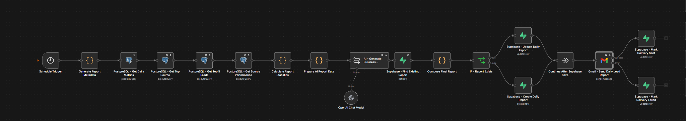

*Complete imported n8n workflow used for Task 9.*

```text
Schedule Trigger
        ↓
Generate Report Metadata
        ↓
PostgreSQL - Get Daily Metrics
        ↓
PostgreSQL - Get Top Source
        ↓
PostgreSQL - Get Top 5 Leads
        ↓
PostgreSQL - Get Source Performance
        ↓
Calculate Report Statistics
        ↓
Prepare AI Report Data
        ↓
AI - Generate Business Summary
        ↓
Supabase - Find Existing Report
        ↓
Compose Final Report
        ↓
IF - Report Exists
      ↙              ↘
Update Report      Create Report
      ↘              ↙
Continue After Supabase Save
        ↓
Gmail - Send Daily Lead Report
      ↙                         ↘
Success                         Error
  ↓                              ↓
Mark Delivery Sent      Mark Delivery Failed
```

---

# Data Flow

```text
Neon PostgreSQL
      ↓
Live Lead Data
      ↓
n8n
      ↓
Business Metrics + Source Analysis
      ↓
AI Model
      ↓
Business Interpretation
      ↓
Supabase
      ↓
Persistent Daily Report
      ↓
Gmail
      ↓
Manager
```

A stronger architectural interpretation is:

```text
Neon PostgreSQL
= Primary operational data source

n8n
= Reporting + orchestration engine

AI
= Interpretation layer only

Supabase
= Persistent report history

Gmail
= Manager delivery channel
```

---

# PostgreSQL Database Design

## Existing Table

The project uses the existing:

```sql
public.leads
```

Important fields used by this workflow:

| Column | Type | Purpose |
|---|---|---|
| `id` | integer | Internal lead identifier |
| `lead_uuid` | uuid | Unique lead identifier |
| `name` | varchar | Lead name |
| `email` | varchar | Lead email |
| `phone` | varchar | Lead phone number |
| `company` | varchar | Company |
| `message` | text | Lead message |
| `source` | varchar | Lead acquisition source |
| `lead_score` | integer | AI lead score |
| `lead_status` | varchar | Lead qualification status |
| `lead_category` | varchar | Lead category |
| `qualification_reason` | text | Reason for qualification decision |
| `ai_analyzed_at` | timestamptz | AI processing timestamp |
| `sync_status` | varchar | Synchronization status |
| `created_at` | timestamp | Lead creation time |
| `updated_at` | timestamptz | Last update time |
| `is_converted` | boolean | Conversion state |

---

# Conversion Field Design

Originally, the lead table had qualification statuses such as:

```text
Pending
Qualified
Nurture
Unqualified
```

Instead of adding `Converted` to `lead_status`, a separate field was added:

```sql
is_converted BOOLEAN NOT NULL DEFAULT FALSE
```

SQL used:

```sql
ALTER TABLE public.leads
ADD COLUMN IF NOT EXISTS is_converted BOOLEAN NOT NULL DEFAULT FALSE;
```

## Why a Boolean Was Used

Qualification status and conversion status represent two different business concepts.

For example:

```text
lead_status = Qualified
is_converted = true
```

means the lead was qualified and later converted.

This design avoids losing the original qualification information.

---

# Supabase Report History Table

The workflow stores generated daily reports in:

```sql
public.daily_lead_reports
```

Schema:

```sql
CREATE TABLE IF NOT EXISTS public.daily_lead_reports (
    id BIGSERIAL PRIMARY KEY,

    report_uuid UUID NOT NULL UNIQUE,

    report_date DATE NOT NULL UNIQUE,

    total_leads INTEGER NOT NULL DEFAULT 0
        CHECK (total_leads >= 0),

    new_leads INTEGER NOT NULL DEFAULT 0
        CHECK (new_leads >= 0),

    qualified_leads INTEGER NOT NULL DEFAULT 0
        CHECK (qualified_leads >= 0),

    converted_leads INTEGER NOT NULL DEFAULT 0
        CHECK (converted_leads >= 0),

    average_lead_score NUMERIC(10,2),

    top_source VARCHAR(100),

    conversion_rate NUMERIC(10,2)
        CHECK (conversion_rate >= 0 AND conversion_rate <= 100),

    top_5_leads JSONB NOT NULL DEFAULT '[]'::jsonb,

    ai_summary TEXT,

    delivery_status VARCHAR(30) NOT NULL DEFAULT 'pending'
        CHECK (
            delivery_status IN ('pending', 'sent', 'failed')
        ),

    generated_at TIMESTAMPTZ NOT NULL DEFAULT NOW()
);
```

---

# Why Supabase Is Used

Supabase is used meaningfully as the persistent reporting database.

It stores:

- report UUID
- report date
- all calculated metrics
- Top 5 leads as JSONB
- AI summary
- delivery status
- report generation timestamp

This provides:

- persistent history
- evidence of report execution
- duplicate prevention
- delivery-status tracking
- clear use of both PostgreSQL and Supabase

---

# Workflow Nodes

## 1. Schedule Trigger

**Node:** `Schedule Trigger`

Purpose:

Runs the workflow every day.

Target schedule:

```text
Every Day
08:00 AM
Timezone: Asia/Karachi
```

The workflow was manually tested before activation.

---

## 2. Generate Report Metadata

### Screenshot

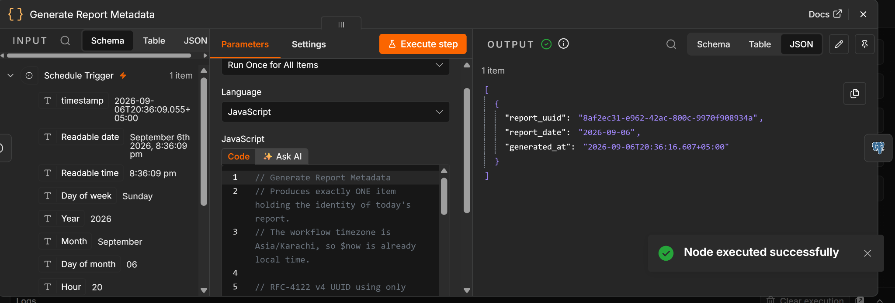

*Successful generation of `report_uuid`, `report_date`, and `generated_at`.*

**Node:** `Generate Report Metadata`

Type:

```text
Code
```

Purpose:

Generates:

- `report_uuid`
- `report_date`
- `generated_at`

Example output:

```json
{
  "report_uuid": "8af2ec31-e962-42ac-800c-9970f908934a",
  "report_date": "2026-09-06",
  "generated_at": "2026-09-06T20:36:16.607+05:00"
}
```

---

# PostgreSQL Reporting Queries

## Core Metrics

### Screenshot

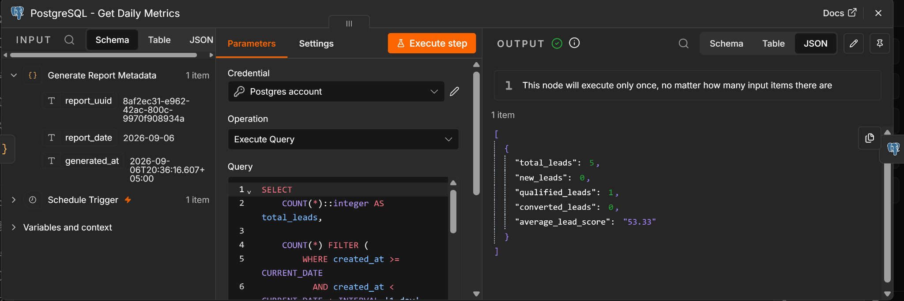

*Live PostgreSQL metrics returned by n8n.*

**Node:** `PostgreSQL - Get Daily Metrics`

```sql
SELECT
    COUNT(*)::integer AS total_leads,

    COUNT(*) FILTER (
        WHERE created_at >= CURRENT_DATE
          AND created_at < CURRENT_DATE + INTERVAL '1 day'
    )::integer AS new_leads,

    COUNT(*) FILTER (
        WHERE lead_status = 'Qualified'
    )::integer AS qualified_leads,

    COUNT(*) FILTER (
        WHERE is_converted = TRUE
    )::integer AS converted_leads,

    COALESCE(
        ROUND(
            AVG(lead_score)
            FILTER (WHERE lead_score IS NOT NULL),
            2
        ),
        0
    ) AS average_lead_score

FROM public.leads;
```

Final tested values:

```text
Total Leads: 5
New Leads: 0
Qualified Leads: 1
Converted Leads: 1
Average Lead Score: 53.33
```

---

## Top Lead Source

### Screenshot

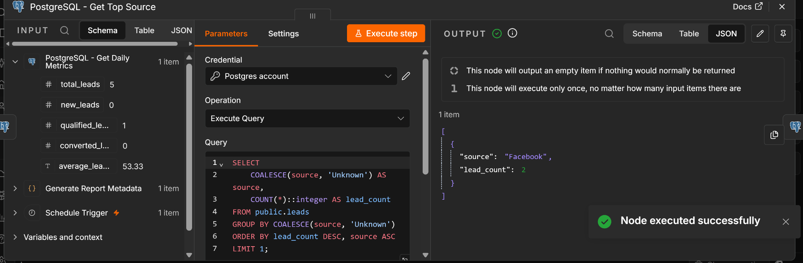

*Facebook returned as the top source with 2 leads.*

**Node:** `PostgreSQL - Get Top Source`

```sql
SELECT
    COALESCE(source, 'Unknown') AS source,
    COUNT(*)::integer AS lead_count
FROM public.leads
GROUP BY COALESCE(source, 'Unknown')
ORDER BY lead_count DESC, source ASC
LIMIT 1;
```

Final tested result:

```text
Top Source: Facebook
Lead Count: 2
```

### Tie Handling

Facebook and Website both had 2 leads.

The workflow uses:

```sql
ORDER BY lead_count DESC, source ASC
```

Therefore, Facebook wins the tie alphabetically.

---

# Top 5 Leads

## Screenshot

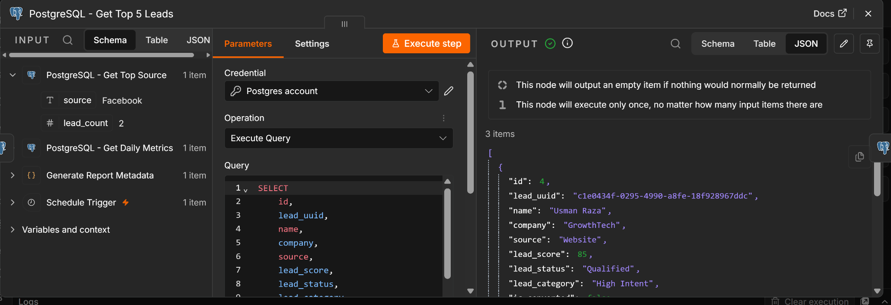

*Scored leads returned in descending order.*

**Node:** `PostgreSQL - Get Top 5 Leads`

```sql
SELECT
    id,
    lead_uuid,
    name,
    company,
    source,
    lead_score,
    lead_status,
    lead_category,
    is_converted
FROM public.leads
WHERE lead_score IS NOT NULL
ORDER BY lead_score DESC, id ASC
LIMIT 5;
```

Final tested result:

| Rank | Lead | Company | Source | Score | Status | Converted |
|---|---|---|---|---:|---|---|
| 1 | Usman Raza | GrowthTech | Website | 85 | Qualified | Yes |
| 2 | Sara Ali | NextWave | LinkedIn | 55 | Nurture | No |
| 3 | Hamza Ahmed | Alpha Solutions | Facebook | 20 | Unqualified | No |

Only 3 leads currently have non-null scores, so the workflow correctly returns 3 rather than forcing 5 records.

---

# Source Performance Analysis

## Screenshot

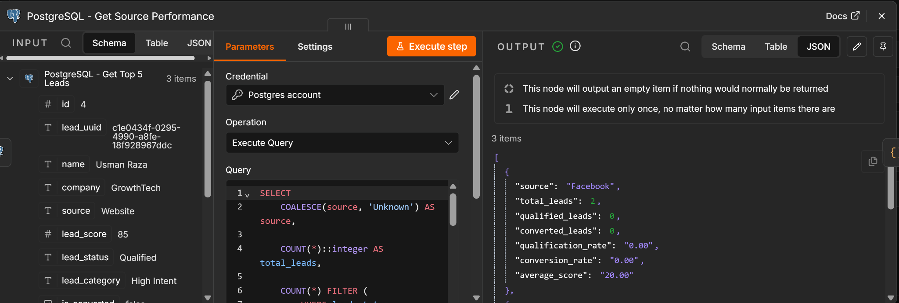

*Per-source qualification, conversion, and average-score analysis.*

**Node:** `PostgreSQL - Get Source Performance`

This node calculates source-level quality metrics so the AI can make supported comparisons.

```sql
SELECT
    COALESCE(source, 'Unknown') AS source,

    COUNT(*)::integer AS total_leads,

    COUNT(*) FILTER (
        WHERE lead_status = 'Qualified'
    )::integer AS qualified_leads,

    COUNT(*) FILTER (
        WHERE is_converted = TRUE
    )::integer AS converted_leads,

    ROUND(
        100.0 *
        COUNT(*) FILTER (WHERE lead_status = 'Qualified')
        / NULLIF(COUNT(*), 0),
        2
    ) AS qualification_rate,

    ROUND(
        100.0 *
        COUNT(*) FILTER (WHERE is_converted = TRUE)
        / NULLIF(COUNT(*), 0),
        2
    ) AS conversion_rate,

    ROUND(
        AVG(lead_score)
        FILTER (WHERE lead_score IS NOT NULL),
        2
    ) AS average_score

FROM public.leads
GROUP BY COALESCE(source, 'Unknown')
ORDER BY total_leads DESC, source ASC;
```

Final tested source performance:

| Source | Total Leads | Qualified | Qualification Rate | Converted | Conversion Rate | Avg Score |
|---|---:|---:|---:|---:|---:|---:|
| Facebook | 2 | 0 | 0.00% | 0 | 0.00% | 20.00 |
| Website | 2 | 1 | 50.00% | 1 | 50.00% | 85.00 |
| LinkedIn | 1 | 0 | 0.00% | 0 | 0.00% | 55.00 |

---

# Calculate Report Statistics

## Screenshot

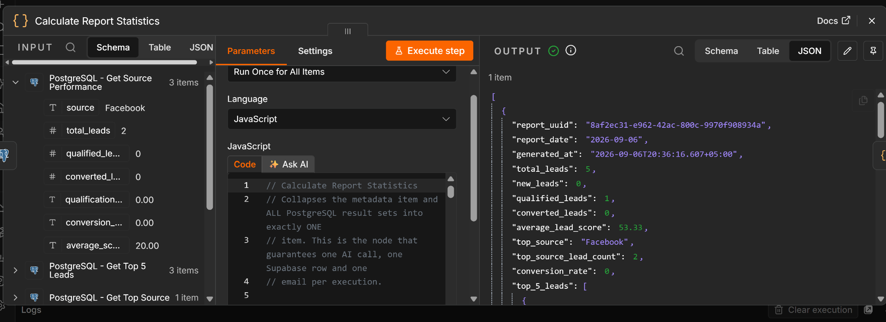

*Multiple PostgreSQL result sets collapsed into exactly one report item.*

**Node:** `Calculate Report Statistics`

Type:

```text
Code
```

Purpose:

Combines:

- report metadata
- core metrics
- top source
- top 5 leads
- source performance

into exactly **one item**.

This is important because multiple PostgreSQL rows could otherwise create:

- multiple AI calls
- multiple emails
- multiple Supabase rows

The node calculates conversion rate as:

```javascript
const conversionRate =
  totalLeads > 0
    ? Number(((convertedLeads / totalLeads) * 100).toFixed(2))
    : 0;
```

Final verified calculation:

```text
Converted Leads = 1
Total Leads = 5

Conversion Rate
= 1 / 5 × 100
= 20.00%
```

---

# Prepare AI Report Data

## Screenshot

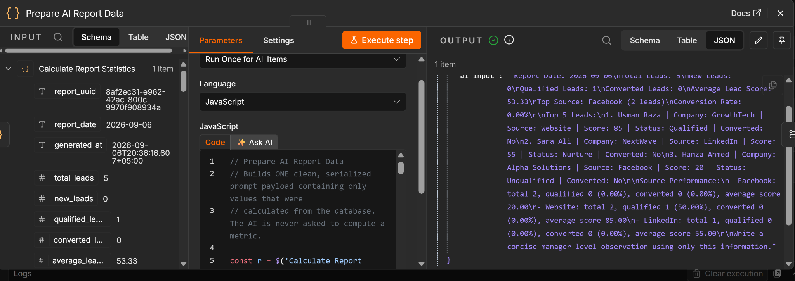

*Verified metrics serialized into a clean AI input payload.*

**Node:** `Prepare AI Report Data`

Purpose:

Creates one clean AI input containing only verified values.

Example tested payload:

```text
Report Date: 2026-09-06
Total Leads: 5
New Leads: 0
Qualified Leads: 1
Converted Leads: 1
Average Lead Score: 53.33
Top Source: Facebook (2 leads)
Conversion Rate: 20.00%

Top 5 Leads:
1. Usman Raza | Company: GrowthTech | Source: Website | Score: 85 | Status: Qualified | Converted: Yes
2. Sara Ali | Company: NextWave | Source: LinkedIn | Score: 55 | Status: Nurture | Converted: No
3. Hamza Ahmed | Company: Alpha Solutions | Source: Facebook | Score: 20 | Status: Unqualified | Converted: No

Source Performance:
- Facebook: total 2, qualified 0 (0.00%), converted 0 (0.00%), average score 20.00
- Website: total 2, qualified 1 (50.00%), converted 1 (50.00%), average score 85.00
- LinkedIn: total 1, qualified 0 (0.00%), converted 0 (0.00%), average score 55.00
```

---

# AI Business Summary

## Screenshot

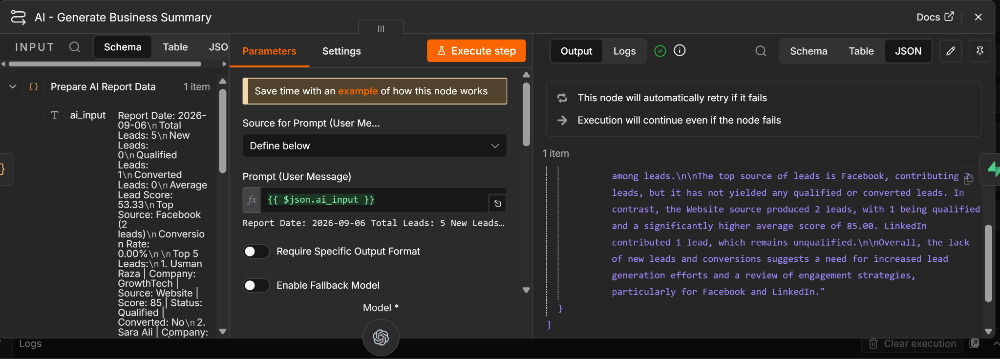

*AI summary generated from verified metrics only.*

**Node:** `AI - Generate Business Summary`

The AI is not allowed to calculate the main statistics.

It only:

- interprets
- summarizes
- highlights patterns
- produces manager-friendly observations

## AI System Prompt

```text
You are a business reporting assistant.

You are given verified lead metrics calculated directly from the database.

Your job is to write a concise daily business summary for a manager.

RULES:

1. Use only the supplied data.
2. Do not invent numbers.
3. Do not modify supplied values.
4. Do not independently calculate the main metrics.
5. Highlight meaningful business observations.
6. Mention important performance signals.
7. Keep the summary professional and concise.
8. If data is insufficient for a comparison, explicitly avoid making that comparison.
9. Do not claim that one source has better qualification or conversion performance unless source-level performance data supports it.
10. Avoid exaggerated recommendations.
11. Focus on practical observations useful to a manager.
12. If there are zero leads, clearly state that there is insufficient lead activity for meaningful performance analysis.
13. If no leads are converted, do not treat this as an error.
14. Mention top lead information when relevant.
15. Return only the business summary.
```

## Final Tested AI Summary

```text
On September 6, 2026, we recorded a total of 5 leads, with no new
leads generated. There was 1 qualified lead, which successfully
converted, resulting in a conversion rate of 20.00%. The average lead
score stands at 53.33, indicating a moderate level of lead quality
overall.

The top source for leads was Facebook, contributing 2 leads, but it
showed no qualified or converted leads, with an average score of only
20.00. In contrast, the Website source performed notably better,
yielding 2 leads with 1 qualified and converted lead, achieving a high
average score of 85.00.

Overall, while we achieved a conversion from the qualified lead, the
lack of new leads and the underperformance of Facebook highlights
areas for potential improvement in lead generation strategies.
```

---

# Compose Final Report

## Screenshot

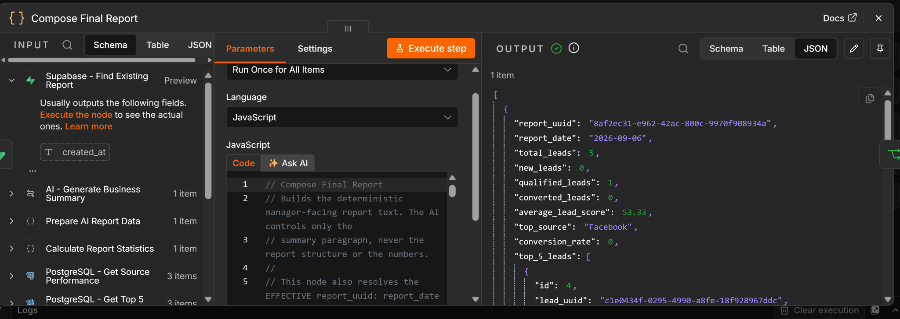

*Deterministic final report composition with metrics, Top 5 leads, and AI summary.*

**Node:** `Compose Final Report`

Purpose:

Creates the deterministic manager-facing report.

The AI does not control the report structure.

Final tested report:

```text
DAILY LEAD REPORT

Report Date: 2026-09-06

KEY METRICS

Total Leads: 5
New Leads: 0
Qualified Leads: 1
Converted Leads: 1
Average Lead Score: 53.33
Top Source: Facebook
Conversion Rate: 20.00%

TOP 5 LEADS

1. Usman Raza | GrowthTech | Website | Score: 85 | Status: Qualified
2. Sara Ali | NextWave | LinkedIn | Score: 55 | Status: Nurture
3. Hamza Ahmed | Alpha Solutions | Facebook | Score: 20 | Status: Unqualified

AI BUSINESS SUMMARY

<AI generated summary>

Report UUID: 8af2ec31-e962-42ac-800c-9970f908934a
```

---

# Supabase Duplicate Prevention

## Duplicate Lookup Screenshot

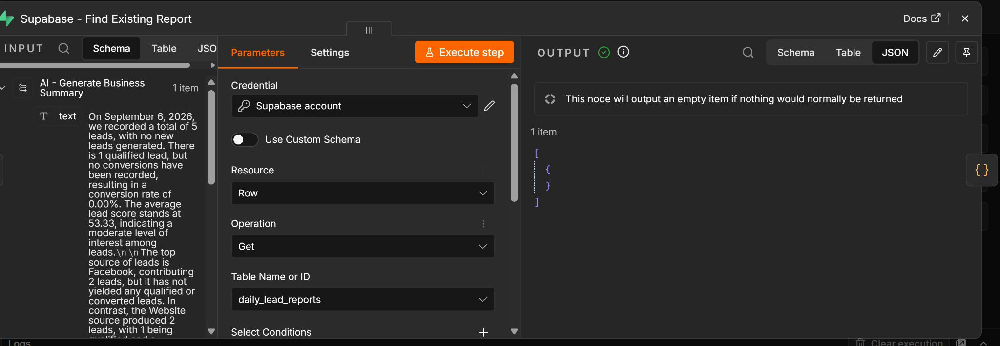

*Supabase checks whether the current report date already exists before writing.*

The `daily_lead_reports` table has:

```sql
report_date DATE NOT NULL UNIQUE
```

The workflow checks whether a report already exists for the same date.

## New Date

### Branching Screenshot

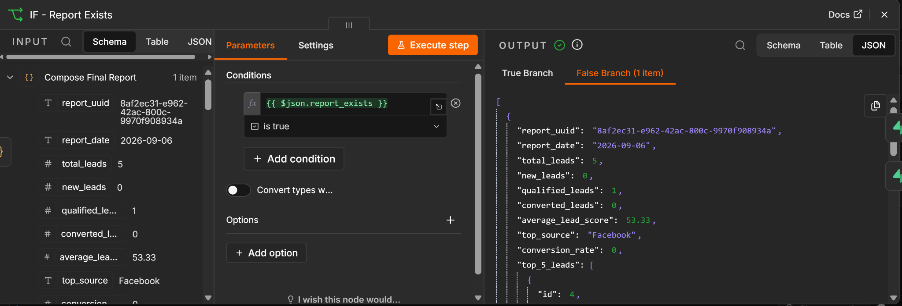

*The IF node routes new dates to Create and existing dates to Update.*

```text
Supabase - Find Existing Report
        ↓
No record
        ↓
IF = False
        ↓
Supabase - Create Daily Report
```

## Existing Date

```text
Supabase - Find Existing Report
        ↓
Existing record found
        ↓
IF = True
        ↓
Supabase - Update Daily Report
```

The workflow preserves the original `report_uuid` for the report date.

Final duplicate verification:

```text
report_date = 2026-09-06
report_count = 1
```

Result:

```text
PASS
```

---

# Supabase Storage Logic

## Create Report Screenshot

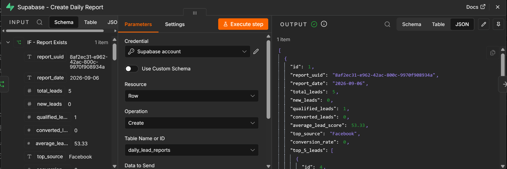

*First daily report stored successfully in Supabase with `delivery_status = pending`.*

Before Gmail delivery:

```text
delivery_status = pending
```

After successful Gmail delivery:

```text
delivery_status = sent
```

If delivery fails:

```text
delivery_status = failed
```

Final verified row:

```text
id = 1
report_date = 2026-09-06
converted_leads = 1
conversion_rate = 20
delivery_status = sent
```

---

# Gmail Report Delivery

## n8n Gmail Success

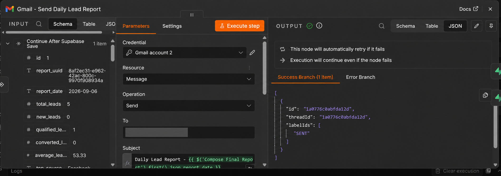

*Gmail node completed on the Success branch.*

## Received Email

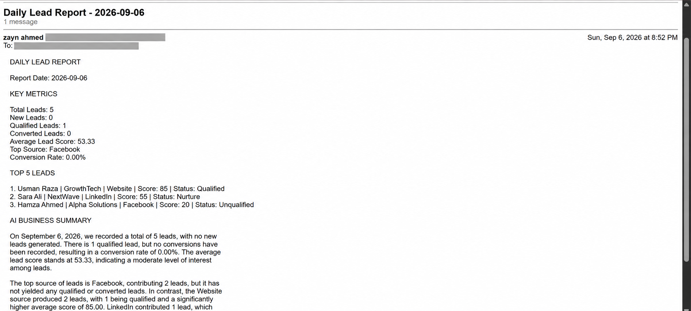

*Manager-facing report received successfully by email.*

**Node:** `Gmail - Send Daily Lead Report`

Subject:

```text
Daily Lead Report - 2026-09-06
```

The Gmail node sends the complete `final_report`.

Successful Gmail execution returns:

```text
Success Branch (1 item)
labelIds = SENT
```

The report was successfully received by the test recipient.

---

# Gmail Success / Failure Handling

## Delivery Status Screenshot

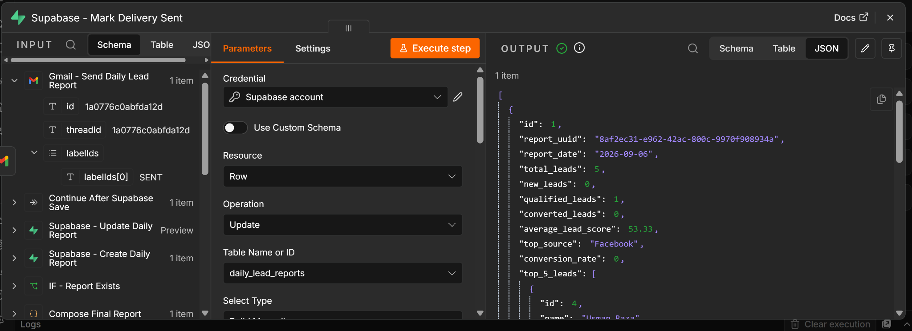

*Supabase report updated to `delivery_status = sent` only after Gmail success.*

The Gmail node has two outputs:

```text
Success
   ↓
Supabase - Mark Delivery Sent

Error
   ↓
Supabase - Mark Delivery Failed
```

This ensures Supabase never reports `sent` unless Gmail actually succeeds.

---

# Error Handling

## PostgreSQL Failure

If the PostgreSQL metrics query fails:

- workflow execution stops
- no valid report is generated
- Gmail is not sent
- Supabase is not incorrectly marked as sent

## AI Failure

If the AI node fails, the workflow uses a safe fallback:

```text
AI summary unavailable for this execution.
Verified database metrics are shown above.
```

The workflow never invents an AI summary.

## Gmail Failure

If Gmail fails:

```text
delivery_status = failed
```

## Empty Data Handling

The workflow also supports an empty database.

Fallback values include:

```text
total_leads = 0
new_leads = 0
qualified_leads = 0
converted_leads = 0
average_lead_score = 0
top_source = N/A
conversion_rate = 0
top_5_leads = []
```

---

# Database Verification Queries

## Verification Screenshots

### Total Leads

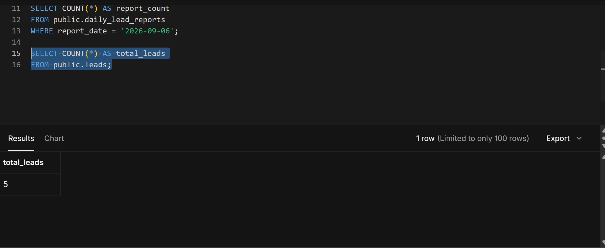

### Qualified Leads

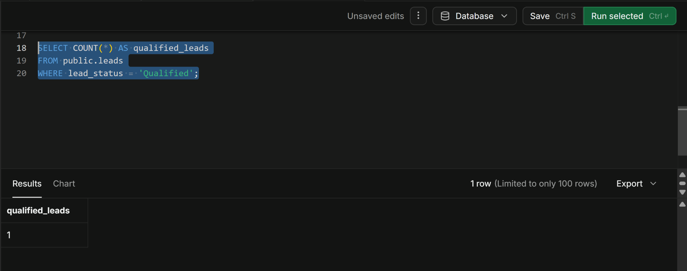

### Average Lead Score

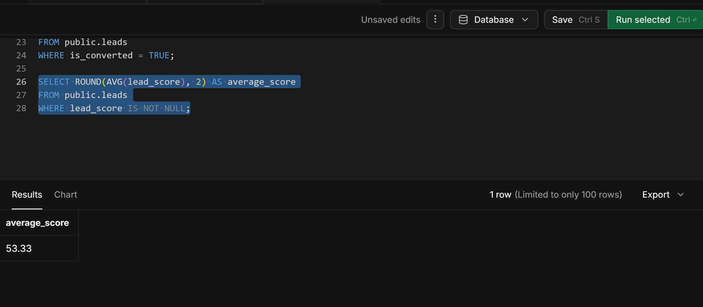

### Source Counts

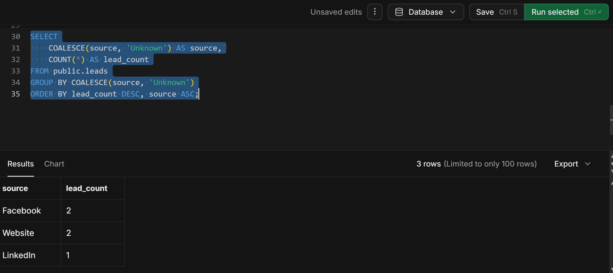

### Converted Leads

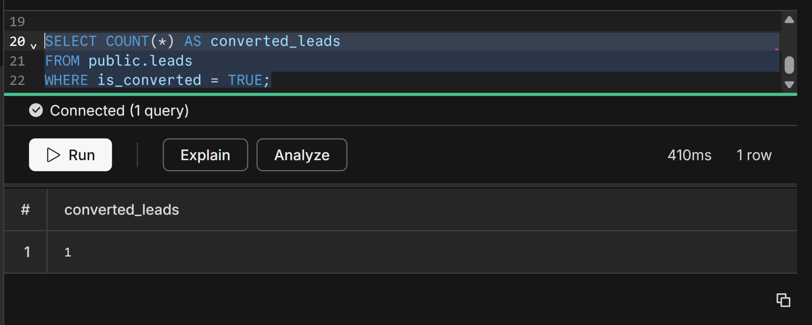

### Top Scored Leads

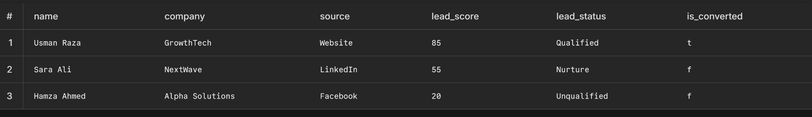

## Total Leads

```sql
SELECT COUNT(*) AS total_leads
FROM public.leads;
```

Verified result:

```text
5
```

---

## Qualified Leads

```sql
SELECT COUNT(*) AS qualified_leads
FROM public.leads
WHERE lead_status = 'Qualified';
```

Verified result:

```text
1
```

---

## Converted Leads

```sql
SELECT COUNT(*) AS converted_leads
FROM public.leads
WHERE is_converted = TRUE;
```

Verified result:

```text
1
```

---

## Average Lead Score

```sql
SELECT ROUND(AVG(lead_score), 2) AS average_score
FROM public.leads
WHERE lead_score IS NOT NULL;
```

Verified result:

```text
53.33
```

---

## Lead Sources

```sql
SELECT
    COALESCE(source, 'Unknown') AS source,
    COUNT(*) AS lead_count
FROM public.leads
GROUP BY COALESCE(source, 'Unknown')
ORDER BY lead_count DESC, source ASC;
```

Verified result:

| Source | Count |
|---|---:|
| Facebook | 2 |
| Website | 2 |
| LinkedIn | 1 |

---

## Top Scored Leads

```sql
SELECT
    name,
    company,
    source,
    lead_score,
    lead_status,
    is_converted
FROM public.leads
WHERE lead_score IS NOT NULL
ORDER BY lead_score DESC, id ASC
LIMIT 5;
```

Verified result:

| Lead | Score |
|---|---:|
| Usman Raza | 85 |
| Sara Ali | 55 |
| Hamza Ahmed | 20 |

---

# Test Cases

## Test Case 1 — Normal Daily Report

Expected:

- PostgreSQL metrics retrieved
- top source retrieved
- top leads retrieved
- statistics calculated
- AI summary generated
- Supabase row created
- Gmail report sent
- delivery status changed to `sent`

Result:

```text
PASS
```

---

## Test Case 2 — Verify Total Leads

Expected:

```text
Report total = PostgreSQL COUNT(*)
```

Actual:

```text
5 = 5
```

Result:

```text
PASS
```

---

## Test Case 3 — Verify Qualified Leads

Expected:

```text
Report qualified count = PostgreSQL qualified count
```

Actual:

```text
1 = 1
```

Result:

```text
PASS
```

---

## Test Case 4 — Verify Converted Leads

Expected:

```text
Report converted count = PostgreSQL is_converted count
```

Actual:

```text
1 = 1
```

Result:

```text
PASS
```

---

## Test Case 5 — Verify Average Score

Expected:

```text
53.33
```

Actual:

```text
53.33
```

Result:

```text
PASS
```

---

## Test Case 6 — Verify Top Source

Expected:

```text
Facebook
```

Actual:

```text
Facebook
```

Result:

```text
PASS
```

---

## Test Case 7 — Verify Top 5 Leads

Expected:

```text
Usman Raza
Sara Ali
Hamza Ahmed
```

Actual:

```text
Usman Raza
Sara Ali
Hamza Ahmed
```

Result:

```text
PASS
```

---

## Test Case 8 — Conversion Rate

### Conversion Evidence

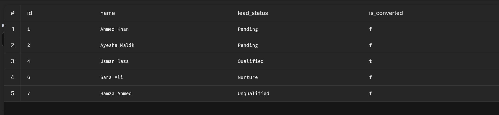

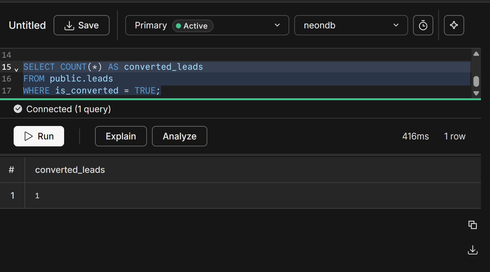

*Usman Raza was marked converted for testing; converted lead count became 1.*

Formula:

```text
Converted Leads / Total Leads × 100
```

Calculation:

```text
1 / 5 × 100
= 20.00%
```

Workflow result:

```text
20.00%
```

Result:

```text
PASS
```

---

## Test Case 9 — Supabase Report Storage

Expected:

Latest report exists in:

```text
daily_lead_reports
```

Actual:

```text
id = 1
report_date = 2026-09-06
delivery_status = sent
```

Result:

```text
PASS
```

---

## Test Case 10 — Duplicate Report Prevention

### Evidence

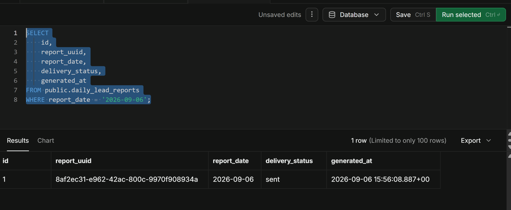

*Verification shows only one row remains for `2026-09-06` after repeated execution.*

Workflow executed again for the same date.

Expected:

```text
Existing row should be updated
No second row should be created
```

Verification:

```sql
SELECT COUNT(*) AS report_count
FROM public.daily_lead_reports
WHERE report_date = '2026-09-06';
```

Actual:

```text
report_count = 1
```

Result:

```text
PASS
```

---

## Test Case 11 — Gmail Notification

### Final Conversion Report Evidence

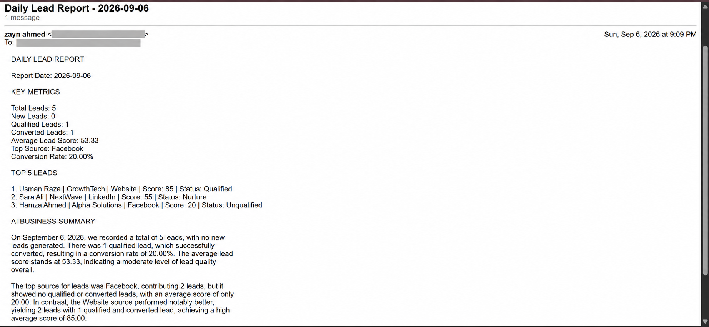

*Final email reflects `Converted Leads = 1` and `Conversion Rate = 20.00%`.*

Expected:

Manager receives report.

Actual:

```text
Email received successfully
Subject: Daily Lead Report - 2026-09-06
```

Result:

```text
PASS
```

---

## Test Case 12 — Delivery Status

### Final Delivery Evidence

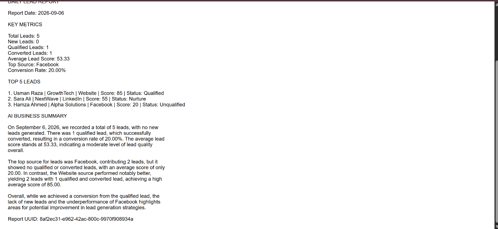

*Final stored report remains `sent` after successful delivery.*

Expected:

```text
pending → sent
```

Actual:

```text
sent
```

Result:

```text
PASS
```

---

# Final Test Summary

| Test | Result |
|---|---|
| Workflow Execution | PASS |
| PostgreSQL Connection | PASS |
| Total Leads | PASS |
| New Leads | PASS |
| Qualified Leads | PASS |
| Converted Leads | PASS |
| Average Lead Score | PASS |
| Top Source | PASS |
| Top Leads | PASS |
| Source Performance | PASS |
| Conversion Rate | PASS |
| AI Input | PASS |
| AI Summary | PASS |
| Supabase Create | PASS |
| Supabase Update | PASS |
| Duplicate Prevention | PASS |
| Gmail Delivery | PASS |
| Delivery Status Update | PASS |

---

# Important Design Principle

The most important reliability rule in this project is:

> **AI does not calculate the main statistics.**

The following values are calculated by PostgreSQL and n8n:

- Total Leads
- New Leads
- Qualified Leads
- Converted Leads
- Average Lead Score
- Top Source
- Top 5 Leads
- Conversion Rate
- Source Performance

The AI only:

- summarizes
- interprets
- explains
- identifies meaningful observations

This makes the workflow:

- reliable
- deterministic
- auditable
- easier to test
- safer for business reporting

---

# Screenshots

The screenshots captured during development and testing are already included in the repository under:

```text
screenshots/
```

The 27 public-safe screenshots are embedded in the relevant sections of this README. The Gmail screenshots use `-redacted` filenames because personal sender and recipient addresses were removed before publication.

---

# Repository Structure

```text
Task-9-Automated-Database-Reporting/
│
├── README.md
├── Task 9 - Automated Daily Lead Report.json
└── screenshots/
    ├── 01-full-n8n-workflow.png
    ├── ...
    └── 27-verify-top-leads.png
```

---

# Security

No credentials should be committed to the repository.

Do **not** include:

- PostgreSQL passwords
- Supabase keys
- Supabase service-role keys
- OpenAI API keys
- Gmail OAuth tokens
- OAuth client secrets
- database connection strings containing secrets

Credentials should remain configured securely inside n8n.

---

# Final Project Status

```text
PROJECT STATUS: COMPLETED
WORKFLOW STATUS: FUNCTIONALLY VERIFIED
DATABASE METRICS: VERIFIED
AI SUMMARY: VERIFIED
SUPABASE STORAGE: VERIFIED
DUPLICATE PREVENTION: VERIFIED
GMAIL DELIVERY: VERIFIED
CONVERSION LOGIC: VERIFIED
ALL MAJOR TESTS: PASS
```

---

# Conclusion

This project demonstrates a complete automated database reporting pipeline using both **PostgreSQL and Supabase**.

The final solution successfully:

- retrieves live lead data from PostgreSQL
- calculates reliable business metrics
- tracks conversions separately from qualification
- performs source-level analysis
- prevents AI from inventing calculations
- creates an AI-generated business interpretation
- stores reports in Supabase
- prevents duplicate daily reports
- sends the report through Gmail
- tracks delivery success/failure
- supports repeatable verification with SQL

The architecture clearly demonstrates the required flow:

```text
PostgreSQL
   ↓
n8n
   ↓
Business Metrics
   ↓
AI Interpretation
   ↓
Supabase Report History
   ↓
Gmail Delivery
```

The project is ready for university submission.
