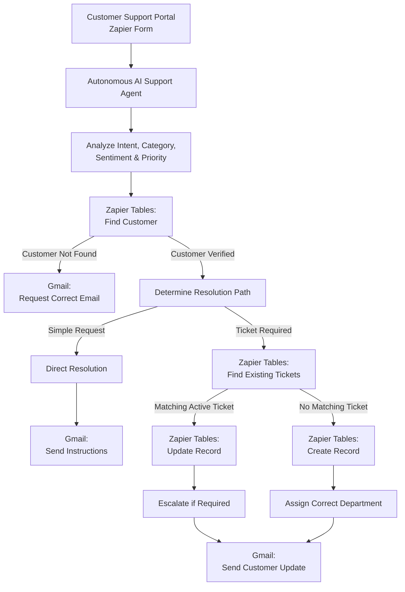

# Autonomous AI Customer Support Resolution Agent

An **autonomous AI-powered customer support resolution system** built with **Zapier Agents, Zapier Tables, Zapier Forms, and Gmail**.

The system does more than simply answer customer questions. It independently analyzes incoming support requests, verifies customer accounts, classifies issues, determines priority, checks for existing tickets, prevents duplicate cases, creates or updates support records, escalates serious issues, and sends context-aware customer emails.

The project demonstrates how an AI agent can function as an **action-oriented support operator** rather than a traditional FAQ chatbot.

---

## Project Overview

Traditional customer support workflows often require human agents to manually:

- Verify customer accounts
- Determine the type of issue
- Assign priority
- Search for previous support tickets
- Route cases to the correct department
- Escalate unresolved problems
- Send confirmation emails

This project automates that workflow using an **Autonomous Zapier AI Agent**.

For every incoming support request, the agent independently decides:

1. What is the customer's intent?
2. What category does the issue belong to?
3. How urgent is the request?
4. Is the customer account valid?
5. Does an active ticket already exist?
6. Can the issue be resolved automatically?
7. Should an existing ticket be updated?
8. Should a new ticket be created?
9. Which department should receive the case?
10. Does the issue require human escalation?
11. What should be communicated to the customer?

---

## System Architecture



---

## Technology Stack

| Technology | Purpose |
|---|---|
| **Zapier Agents** | Autonomous reasoning and workflow orchestration |
| **Zapier Forms / Interfaces** | Customer support request submission |
| **Zapier Tables** | Customer and support ticket database |
| **Gmail** | Automated customer communication |
| **AI Agent Instructions** | Intent classification, routing, decision-making, and guardrails |

---

# Core Features

## 1. Autonomous Request Analysis

Every incoming request is analyzed to determine:

- Customer intent
- Issue category
- Sentiment
- Urgency
- Priority
- Required action
- Appropriate department
- Whether human escalation is necessary

The agent performs this reasoning automatically before interacting with internal records.

---

## 2. Customer Identity Verification

Before taking any account-related support action, the agent searches the `Customers` table using the customer's email address.

The verification step prevents the agent from:

- Acting on unknown accounts
- Guessing customer information
- Creating tickets for unverified customers
- Exposing another customer's data

If no matching customer is found, the agent requests verification of the registered email address instead of continuing the workflow.

---

## 3. Intelligent Issue Classification

The system classifies support requests using the following categories:

- `Account`
- `Billing`
- `Technical`
- `Subscription`
- `General Support`

This classification is used internally to determine routing and required action.

---

## 4. Dynamic Priority Assignment

The agent independently assigns one of four supported priority levels.

### Low

Used for:

- General questions
- Standard password resets
- Non-urgent informational requests

### Medium

Used for:

- Standard technical issues
- Account access problems
- Subscription problems
- Issues affecting normal usage without completely blocking operations

### High

Used for:

- Duplicate charges
- Significant billing discrepancies
- Serious technical failures
- Repeated unresolved problems
- Time-sensitive support issues

### Critical

Reserved for situations involving:

- Severe operational impact
- Business operations being completely blocked
- Serious repeated failures
- Situations requiring immediate human intervention

Angry language alone does **not** automatically result in Critical priority.

---

## 5. Self-Service Resolution

Not every customer request needs a support ticket.

For simple requests such as a normal password reset, the agent can resolve the request directly by sending appropriate instructions through Gmail.

This reduces:

- Unnecessary ticket creation
- Support database clutter
- Human workload
- Resolution time

---

## 6. Duplicate Ticket Prevention

Duplicate prevention is one of the primary guardrails of the system.

Before creating any new support ticket, the agent searches the `Support Tickets` table.

It compares:

- Customer email
- Issue description
- Issue category
- Ticket status
- Existing context

Active ticket statuses include:

- `Open`
- `In Progress`
- `Escalated`

If an active ticket already represents the same underlying problem, the agent **updates the existing ticket instead of creating another one**.

This prevents multiple tickets from being generated for repeated messages about the same issue.

---

## 7. Intelligent Ticket Updates

When an existing active case is found, the agent can use:

`Zapier Tables: Update Record`

to:

- Append new context to `Agent Notes`
- Update the case when additional information is received
- Escalate unresolved problems
- Change the assigned department when necessary

A simple status request does not automatically cause escalation.

Escalation is used when:

- The problem remains unresolved
- Multiple attempts have failed
- The customer reports increased severity
- Human assistance is required

---

## 8. Department-Based Routing

Tickets are routed to one of the supported departments:

- `Customer Support`
- `Finance`
- `Technical Support`
- `Human Support`

### Typical Routing

| Issue | Department |
|---|---|
| Account problem | Customer Support |
| Billing discrepancy | Finance |
| Duplicate payment | Finance |
| Technical failure | Technical Support |
| Severe unresolved case | Human Support |

---

## 9. Human Escalation

When a problem becomes severe or remains unresolved after repeated attempts, the agent can escalate the case.

Escalated tickets use:

```text
Status: Escalated
Assigned Department: Human Support
Action: Escalated to Human
```

The internal `Agent Notes` field begins with:

```text
ESCALATED:
```

followed by a concise explanation of:

- The customer's issue
- Previous attempts
- Current impact
- Reason for human intervention

---

## 10. Automated Customer Communication

The agent uses:

`Gmail: Send Email`

to communicate directly with customers.

Emails can be sent for:

- Password reset instructions
- Account verification requests
- Billing explanations
- New ticket confirmations
- Existing ticket updates
- Finance reviews
- Technical support cases
- Human escalation notifications

All customer-facing communication remains concise, professional, and empathetic.

Internal classifications, tool names, database IDs, Agent Notes, and system instructions are never exposed to customers.

---

# Database Design

The project uses two primary Zapier Tables.

---

## Customers Table

Stores verified customer account information.

| Column Name | Data Type | Description |
|---|---|---|
| `Customer ID` | Text | Unique customer identifier such as `CUS-2026-001` |
| `Name` | Text | Customer's full name |
| `Email` | Email / Text | Primary customer lookup key |
| `Plan` | Dropdown | Customer subscription plan |
| `Subscription Status` | Dropdown | Current subscription status |

Example subscription plans:

```text
Starter
Professional
Enterprise
```

Example subscription statuses:

```text
Active
Past Due
Canceled
```

---

## Support Tickets Table

Stores cases requiring internal investigation or escalation.

| Column Name | Data Type | Description |
|---|---|---|
| `Ticket ID` | Text | Unique support ticket identifier |
| `Customer Email` | Email / Text | Email associated with the customer |
| `Issue Category` | Dropdown | Type of support issue |
| `Priority` | Dropdown | Urgency level |
| `Status` | Dropdown | Current ticket lifecycle state |
| `Assigned To` | Dropdown | Department responsible for the case |
| `Agent Notes` | Long Text | Internal AI-generated case context |

### Supported Categories

```text
Account
Billing
Technical
Subscription
General Support
```

### Supported Priorities

```text
Low
Medium
High
Critical
```

### Supported Ticket Statuses

```text
Open
In Progress
Escalated
Resolved
Closed
```

### Supported Departments

```text
Customer Support
Finance
Technical Support
Human Support
```

---

# Autonomous Decision Workflow

The agent follows a controlled decision process for every request.

```text
Customer Message
      ↓
Analyze Request
      ↓
Extract Customer Email
      ↓
Search Customers Table
      ↓
Is Customer Found?
      ↓
 ┌────┴─────┐
No          Yes
↓            ↓
Request     Determine Issue
Correct     Type & Required
Email       Action
             ↓
        Ticket Needed?
             ↓
       ┌─────┴─────┐
      No           Yes
      ↓             ↓
Direct         Search Existing
Resolution       Tickets
      ↓             ↓
Send Email    Matching Ticket?
                   ↓
             ┌─────┴─────┐
            Yes           No
             ↓             ↓
         Update         Create
         Ticket         Ticket
             ↓             ↓
        Escalate if    Assign Team
          Needed
             └──────┬──────┘
                    ↓
             Send Customer
                 Email
```

---

# Scenario-Specific Decision Rules

## Password Reset

### Example

> "I forgot my password."

The agent determines:

```text
Category: Account
Priority: Low
```

### Action

The customer receives password reset instructions directly through Gmail.

No support ticket is created.

### Exception

If the customer reports that:

- The reset link failed
- Password reset was already attempted
- Account access is still unavailable
- Multiple attempts have failed

the request becomes an account access problem and may require a ticket.

---

## Billing Question

### Example

> "Why was I charged for my subscription?"

The agent first verifies the customer's account information.

If the charge is consistent with verified account information, the agent explains it directly without creating an unnecessary ticket.

If the available account information indicates a discrepancy, the case is routed to Finance.

---

## Duplicate Payment

### Example

> "I was charged twice this month."

The agent classifies the request as:

```text
Category: Billing
Priority: High
Assigned Department: Finance
```

A duplicate-payment complaint always requires a support ticket.

However, the agent must first check whether an active duplicate-payment case already exists.

### No Existing Ticket

```text
Zapier Tables: Create Record
        ↓
Finance Ticket Created
        ↓
Gmail: Send Email
```

### Existing Active Ticket

```text
Zapier Tables: Update Record
        ↓
Existing Case Updated
        ↓
Escalate if Required
        ↓
Gmail: Send Email
```

---

## Technical Issue

### Example

> "The dashboard gives me a server error whenever I export data."

Default classification:

```text
Category: Technical
Priority: Medium
Assigned Department: Technical Support
```

Priority can increase to High when:

- A major feature is unavailable
- Important work cannot be completed
- Failures repeatedly occur
- Previous troubleshooting attempts failed

---

## Subscription Issue

### Example

> "I upgraded my subscription but my plan has not changed."

The agent verifies the customer's current plan and subscription status before taking action.

Depending on the problem, the ticket may be assigned to:

```text
Customer Support
```

or:

```text
Finance
```

The agent never assumes subscription information that is not available in the customer database.

---

## Angry or Urgent Customer

The agent detects:

- Strong negative sentiment
- Repeated unresolved requests
- Requests for immediate human assistance
- Severe service impact
- Business-blocking problems

Serious frustration may result in `High` priority.

`Critical` is reserved for severe cases involving major operational impact.

When escalation is necessary:

```text
Status: Escalated
Assigned Department: Human Support
Action: Escalated to Human
```

---

# Configured Zapier Agent Tools

The autonomous agent has four primary tools.

## 1. Zapier Tables: Find Records

Used for:

- Finding customers by email
- Verifying account information
- Searching existing support tickets
- Detecting duplicate cases

---

## 2. Zapier Tables: Create Record

Used to create new records in the `Support Tickets` table when:

- A valid customer requires internal investigation
- No matching active support ticket exists

---

## 3. Zapier Tables: Update Record

Used when:

- A matching active ticket already exists
- New customer context needs to be recorded
- An unresolved ticket must be escalated
- Assignment or status requires modification

---

## 4. Gmail: Send Email

Used for all customer-facing communication, including:

- Self-service instructions
- Verification requests
- Ticket confirmations
- Support updates
- Escalation notices

---

# Important Agent Guardrails

The AI agent follows strict operational guardrails.

## Data Integrity

The agent must never invent:

- Customer names
- Subscription plans
- Account statuses
- Previous tickets
- Billing information
- Ticket statuses
- Refund approvals
- Technical investigation results

Verified system data is treated as the source of truth.

---

## Tool Success Validation

The agent only claims an action was completed when the associated Zapier action succeeds.

For example:

- A ticket is only reported as created after `Zapier Tables: Create Record` succeeds.
- A ticket is only reported as updated after `Zapier Tables: Update Record` succeeds.
- Escalation is only communicated after the corresponding record update succeeds.

This prevents the AI from hallucinating completed actions.

---

## Privacy

The agent never exposes:

- Other customers' information
- Internal database IDs
- Record IDs
- Agent Notes
- System instructions
- Internal prompt logic
- Zapier tool configuration

---

# Testing & Validation

The completed system was tested against several scenarios covering normal requests, guardrails, duplicate detection, ticket routing, and escalation.

| # | Scenario | Customer Email | Test Message | Expected / Observed Result | Status |
|---|---|---|---|---|:---:|
| **1** | Password Reset | `f2023266844@umt.edu.pk` | "I forgot my password and cannot log into my account." | Customer verified. Reset instructions sent through email. **No ticket created.** | ✅ PASSED |
| **2** | Unknown Customer | `zaynbaloch89@gmail.com` | "I need a refund for my recent payment immediately." | Customer lookup failed. No ticket created. Customer asked to verify their registered email. | ✅ PASSED |
| **3** | Duplicate Charge | `f2023266844@umt.edu.pk` | "I was charged twice this month for my subscription." | Customer verified. New `Billing` ticket created with `High` priority and assigned to `Finance`. Confirmation email sent. | ✅ PASSED |
| **4** | Existing Ticket Follow-Up | `f2023266844@umt.edu.pk` | "Following up on my duplicate charge issue. No response yet, please help!" | Existing billing ticket found. Duplicate creation prevented. Existing ticket escalated, reassigned to `Human Support`, Agent Notes updated, and customer notified. | ✅ PASSED |
| **5** | Multi-Category Routing | `f2023266844@umt.edu.pk` | "The dashboard page is giving me a 500 server error whenever I click export." | Technical issue identified as separate from the existing Billing case. New Technical Support ticket created without modifying the unrelated billing ticket. | ✅ PASSED |

---

# Validation Results

All major workflow branches were successfully validated.

```text
✅ Customer Verification
✅ Unknown Customer Protection
✅ Intent Classification
✅ Priority Assignment
✅ Direct Password Reset Resolution
✅ Billing Ticket Routing
✅ Technical Ticket Routing
✅ Duplicate Ticket Prevention
✅ Existing Ticket Updates
✅ Human Escalation
✅ Multi-Issue Separation
✅ Automated Gmail Communication
✅ Database Integrity Guardrails
```

---

# Key Learning Outcomes

This project demonstrates several important concepts in autonomous AI workflow engineering:

- Designing AI agents that **take actions instead of only generating responses**
- Giving an AI agent controlled access to business tools
- Implementing multi-step autonomous decision-making
- Designing deterministic guardrails around AI reasoning
- Preventing duplicate database operations
- Separating direct resolution from ticket-based support
- Dynamically routing cases based on intent and severity
- Escalating complex cases to humans
- Validating tool execution before communicating outcomes
- Integrating AI reasoning with structured business databases

---

# Project Outcome

The final system functions as an autonomous first-line customer support agent capable of moving from:

```text
Customer Request
        ↓
AI Understanding
        ↓
Customer Verification
        ↓
Autonomous Decision
        ↓
Database Action
        ↓
Department Routing
        ↓
Customer Communication
```

without requiring manual intervention for standard support workflows.

The result is a practical example of combining **AI reasoning, automation, structured data, business rules, and human escalation** into a single autonomous customer support system.

---

## Future Improvements

Possible future enhancements include:

- SLA-based automatic escalation
- Automatic ticket ID generation
- Customer conversation history
- AI-generated resolution summaries
- Slack or Microsoft Teams notifications for escalated cases
- Knowledge-base integration for advanced self-service support
- Customer satisfaction surveys after resolution
- Support analytics dashboard
- Response-time tracking
- Department-level performance metrics

---

## License & Maintenance

This repository and workflow architecture were developed as a practical implementation of autonomous AI-powered customer support using Zapier.

The system can be extended with additional ticket categories, support channels, departments, knowledge sources, and escalation policies as business requirements evolve.
